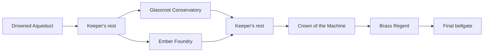

<div align="center">

# Cinderwake

**Carry the last fragment of a broken sun.**

A clockwork action roguelite, built in Rust.<br>
Climb the ruined city. Descend beneath it. Silence the Brass Regent.

[](https://www.rust-lang.org/)
[](https://macroquad.rs/)
[](LICENSE)
[](#project-status)
[](https://github.com/nearbycoder/Cinderwake/actions/workflows/ci.yml)

**[Play in your browser](https://nearbycoder.github.io/Cinderwake/)** · [Trailer](https://github.com/nearbycoder/Cinderwake/raw/refs/heads/main/docs/media/cinderwake-demo.mp4) · [Build and play](#play) · [Explore the city](#a-city-with-depth) · [Controls](#controls) · [Engine notes](docs/ENGINE.md)

</div>

<p align="center">
  <a href="https://github.com/nearbycoder/Cinderwake/raw/refs/heads/main/docs/media/cinderwake-demo.mp4"></a>
</p>

<p align="center"><strong><a href="https://github.com/nearbycoder/Cinderwake/raw/refs/heads/main/docs/media/cinderwake-demo.mp4">Watch the trailer · MP4 · 43 seconds · 1080p</a></strong></p>

**[Play in your browser](https://nearbycoder.github.io/Cinderwake/)**: a 53 MB download, then keyboard, mouse, or controller, or [on-screen controls](#on-a-touch-screen) on a phone or tablet held sideways. It was checked in headless Chromium 151 and Firefox 157 on Linux, and with iPhone, iPad, and Android phone profiles in headless WebKit and Chromium, but not yet on a real phone or in Safari itself. Progress and options stay in that browser, sound starts with the first key, click, or tap, there's no Quit (close the tab), and Ultra keeps sharp unfiltered textures; [more on the browser version](#in-a-browser).

The **trailer** is recorded from the game at graphics fidelity Ultra: 11 seconds of a scripted fight with live physics and combat, the route from the upper galleries down into the undercroft and on to the bellgate (guardians removed so the route is visible; normal play has them), a camera tour of the four biomes, and the Regent's arena and three menus as staged game screens. Its sound is the game's own music and the effects those frames played, with no narration. The preview above is a silent excerpt of the fight. See [how the media is made](docs/media/README.md).

You are a small brass automaton in a city of copper, glass, and failing machinery. Fight across upper galleries, surface works, and buried chambers; collect equipment and memories; then carry your embers to the next bellgate before the city claims them back.

## What you can play

- **Responsive combat, on keyboard, mouse, or controller.** Chain melee strikes, reflect projectiles with directional parries, dodge through danger, fire glassbolts, throw fire vessels, and deploy arc snares. A press made a moment before its move is ready (up to 0.15 s) still happens as soon as it is. A press that comes too early, or a flask with none left, briefly outlines its slot on the HUD; the flask's slot fills as you drink and says when a hit cut the drink short (the flask isn't spent); and the dodge and parry show their recovery like the other slots. Every guardian warns before it attacks: a mark over its head, the reach of its strike on the ground or the line of an archer's aim, and a short sound. One winding up out of view, or a bolt flying in from off screen, gets a marker at the edge of the screen pointing toward it, and at low vitality the screen's edges glow red and the flask slot lights up.
- **Three elevations to explore.** Double jump into upper galleries, drop through ledges into the undercroft, and find connected routes back to the surface. A two-axis camera and full-height atlas follow the journey: the camera runs ahead of a fall so you see where you'll land, and holding down while standing looks below the ledge.
- **A branching run.** Four biome themes, three stages per run, four guardian types, and a final fight against the Brass Regent.
- **Choices that carry weight.** Three melee weapons, weapon tiers and scorching upgrades, three stat disciplines, two run mutations, copper forging, and permanent vitality and flask upgrades.
- **A city in motion.** Layered panoramas change with horizontal progress and elevation. Waterwheels turn, cloth sways, steam rises, and each biome has its own atmosphere.
- **Detailed pixel presentation.** Generated sprite sheets, action-synchronized animation, dodge afterimages, hit stop, camera shake, event-driven particles, selective bloom, and dynamic combat lighting. The HUD remains crisp above the effects, menus ease into place, and the vitality bar shows what each hit took.
- **A Graphics Fidelity setting.** Four steps from Low to Ultra, on the options page or **F9**; [what each step draws](#graphics-fidelity) is below.
- **Options for how you play.** Music and effects volume, screen shake, hit-stop, reduced flashes, a game speed from 50% to 100%, one-time tips, fullscreen, and rebindable keys; [details below](#settings-and-accessibility).

### Graphics fidelity

Choose a step on the options page (**O**), or press **F9** to cycle through them; the choice is saved. Every step plays the same game; only what's drawn changes.

| Step | What it draws |
| --- | --- |
| **Low** | No bloom, lighting, or colour grading; the scene is scaled to the window nearest-neighbour; half the particles (at most 256). Meant for slower graphics. |
| **Medium** | Bloom at 320 × 180, four combat lights, colour grading, and even-pixel scaling. |
| **High** (default) | The game's usual look: bloom at 640 × 360, eight combat lights, colour grading, and even-pixel scaling. |
| **Ultra** | The world drawn at 2560 × 1440 and filtered down to the window; art sampled from mipmaps (desktop only; the browser build keeps nearest sampling); lamps, forges, wells, and the bellgate light their surroundings, with up to sixteen lights; bloom at 1280 × 720 plus a wide halo; light sharpening and a soft highlight roll-off; half again as many sparks and debris (at most 1,024 particles). |

Even-pixel scaling keeps every pixel the same width when the window isn't a whole multiple of 1280 × 720. Measured on the AMD Radeon 8060S used for development, at 2560 × 1440, Low, Medium, and High cost the same within 2% and Ultra 15–25% more; the GPU was shared with other work, so treat those figures as rough, and nobody has measured what Low saves on genuinely weak graphics. The trailer and screenshots here are at Ultra.

## A city with depth

Every biome connects **upper galleries → surface works → undercroft** through stairways, platforms, gaps, and drop shafts. Backtracking is possible; elevation changes both the route and the backdrop. Layouts are authored, with seeded enemy and reward variation.

| Biome | The journey |
| --- | --- |
| **Drowned Aqueduct** | Flooded galleries, waterwheels, and the city's old pumpworks. Every run begins here. |
| **Glassroot Conservatory** | Glass cloisters, overgrown roots, and a moonlit rotunda. One branch from the first bellgate. |
| **Ember Foundry** | Chain lifts, crucibles, and the turbine heart. The other branch. |
| **Crown of the Machine** | High bridges and celestial machinery, watched over by the Brass Regent. |

<table>
  <tr>
    <td><a href="docs/media/rooftops.png"></a><br><strong>Above the city</strong><br>Climb into the upper galleries.</td>
    <td><a href="docs/media/undercroft.png"></a><br><strong>Below the surface</strong><br>Explore the undercroft and return through connected shafts.</td>
  </tr>
  <tr>
    <td><a href="docs/media/combat.png"></a><br><strong>Clockwork combat</strong><br>A guardian warns before it strikes: a mark over its head and its reach along the ground.</td>
    <td><a href="docs/media/atlas.png"></a><br><strong>Read the whole route</strong><br>The atlas maps all three elevations as you explore them (shown fully surveyed). Each kind of object has its own mark, so a forge or sealed cache you passed is easy to find again.</td>
  </tr>
  <tr>
    <td><a href="docs/media/foundry.png"></a><br><strong>The Ember Foundry</strong><br>Machinery, fire, and drifting sparks.</td>
    <td><a href="docs/media/crown.png"></a><br><strong>Crown of the Machine</strong><br>The Brass Regent waits in its final domain.</td>
  </tr>
</table>

Every screenshot is drawn by the game at graphics fidelity Ultra. The galleries and undercroft come from ordinary movement inputs and the combat from a scripted fight; the atlas, Foundry, and Crown views are staged with the game's capture modes.

## Play

You can [play in your browser](https://nearbycoder.github.io/Cinderwake/). There are no downloadable releases yet, so for the desktop version you build the game from source. Install the [Rust toolchain](https://www.rust-lang.org/tools/install), then:

```sh
git clone https://github.com/nearbycoder/Cinderwake.git
cd Cinderwake
cargo run --release --locked
```

Press **Enter** (or **A** on a controller) to begin. Tips introduce each move the first time you need it, and **O** opens the options. All runtime art, fonts, shaders, and audio are embedded in the executable; no asset download or external game service is required.

### System requirements

| | |
| --- | --- |
| **Checked on** | macOS on Apple Silicon (at launch); Linux (CachyOS, Wayland through XWayland, AMD Radeon 8060S integrated graphics, 1.25× display scaling) |
| **Not checked** | Windows, other GPUs, and any minimum specification: nobody has measured how slow a machine can be and still play well. Try **Low** fidelity on weaker graphics |
| **Graphics** | OpenGL on the desktop, through Macroquad; WebGL in the browser |
| **Building** | A current stable Rust toolchain (development uses Rust 1.96). On Linux you may need the X11, OpenGL, ALSA, and udev development packages (udev is for controllers) |
| **Linux tarball** | x86_64 with glibc 2.34 or newer |
| **Browser** | A WebGL-capable browser and a 53 MB download; checked in headless Chromium and Firefox on Linux, and in headless WebKit (iPhone 15 and iPad Pro 11 profiles) and Chromium (Pixel 7 profile) |
| **Input** | Keyboard, with the mouse for menus, strikes, and parries, or a controller. In the browser on phones and tablets, on-screen touch controls |

To build a local macOS app:

```sh
./scripts/package-macos.sh
open dist/Cinderwake.app
```

The script produces an ad-hoc signed app for local use, not a notarized public release.

To build a portable Linux tarball (x86_64, glibc 2.34 or newer):

```sh
./scripts/package-linux.sh   # writes dist/cinderwake-linux-x86_64.tar.gz
```

It contains the executable, licenses, and a short README. It is for local sharing and testing, not a published release.

### In a browser

The browser version is meant to be served by GitHub Pages at <https://nearbycoder.github.io/Cinderwake/>. To build and serve it yourself:

```sh
./scripts/build-pages.sh                  # writes the static site to dist/pages
python3 -m http.server -d dist/pages 8080 # then open http://localhost:8080
node scripts/check-pages.mjs http://localhost:8080/   # exits 0 once the title is drawn with no errors
```

Every address in the site is relative, so it works from any folder, and it needs no special server headers. The game is about 53 MB, almost all of it embedded art and audio, sent as two 26 MB parts that the page joins. While it downloads, the page shows a progress bar, and if the download fails, the browser can't start WebGL, or the game stops with an error, the page says so. Progress, options, and a run in progress are kept in the browser's `localStorage`, so closing the tab mid-run doesn't lose the run.

What differs from the desktop:

- Sound starts with the first key press, click, or tap, as browsers require.
- There's no Quit option; close the tab. **F12** screenshots are desktop-only.
- Fullscreen (**F11** or the options page) has to be asked for on each visit, because browsers only allow it after a key press. Leaving with the browser's **Esc** keeps the setting in step.
- At Ultra the browser keeps nearest-neighbour texture sampling, because WebGL 1 can't mipmap these textures. High is the default, as on the desktop.
- A controller appears once one of its buttons is pressed on the page.
- Saves belong to that browser and site; clearing the site's data deletes them, and they aren't shared with the desktop game.

Tested in headless Chromium 151 and headless Firefox 157 on Linux, with the site served from a `/Cinderwake/` folder as GitHub Pages will: loading to the title with no console errors, the touch controls staying hidden, sound held until the first key, starting a run with the keyboard, running, jumping, striking, dodging, pausing, a fidelity change surviving a reload, and a scripted controller starting a run (`node scripts/test-pages.mjs <url>`). Earlier rounds also checked the atlas, the mouse alone, and pixel ratios of 1 and 1.25 in headless Chrome. Nobody has listened to the browser build, and frame rate on real graphics hardware, Safari, and mobile browsers haven't been checked.

#### On phones and tablets

The browser version plays on phones and tablets held sideways, with [on-screen controls](#on-a-touch-screen):

- The controls appear on devices whose main pointer is a finger (a coarse pointer and no mouse or trackpad), or after the first real touch on any device. A key press, a mouse, or a controller hides them again, and the next touch brings them back. Desktop browsers never show them.
- Menus are tapped: every button, card, row, and link on the game's own screens works by tap, and prompts say **TAP** while the controls are shown. Sound starts with the first tap.
- The game needs landscape. Held upright, the page asks to turn the device and pauses a run until it is.
- The page can't be scrolled, zoomed, or selected, the controls avoid the notch and the home indicator, and several fingers work at once: hold the stick, jump, and strike together, or slide a thumb from one button to the next.
- To fit a phone's memory, the browser build draws at most two device pixels per CSS pixel, decodes only the biome on screen, and keeps the download in one buffer that goes once it's compiled. If the browser still closes the tab for lack of memory, the reloaded page says that this is what probably happened, and a lost graphics context gets its own message instead of a frozen screen.

Checked with `node scripts/test-mobile.mjs <url>` in headless WebKit 26.6 with iPhone 15 and iPad Pro 11 profiles and headless Chromium 151 with a Pixel 7 profile, driving each with touch events: the title, the turn-the-device notice, starting a run by tapping, running with the stick while jumping and striking, every other button, pushing the stick down, the atlas and pause buttons, resuming by tap, and the controls hiding after a key and returning on the next touch. It also confirms they stay hidden in desktop Chromium. Not checked: a real phone or tablet, Safari's actual memory limit, frame rate on a phone's graphics, and how sound behaves on iOS (headless WebKit here has no sound device).

See [build and verification notes](docs/ENGINE.md#build-and-verification) for more detail.

## A run, from first spark to final bell



1. **Explore and equip.** Chests raise your weapon tier and offer a random weapon: take it or keep the one in hand (**1** / **2**). Memories raise Ferocity, Ingenuity, or Resolve. Wells restore health and flasks; forges temper your weapon for copper. Each prompt says what it needs and gives: the forge shows your copper against the 60 it asks, a sealed cache counts the guardians still needed, and the bellgate says how many embers it will bank.
2. **Reach a bellgate.** Carried embers are banked when you leave a biome. At the Keeper's rest, spend them on permanent vitality, flask capacity, or a mutation for the current run.
3. **Choose your branch.** Take the Conservatory or the Foundry, then continue to the Crown.
4. **Defeat the Regent.** The boss unlocks the Crown Rune; the final gate completes the run. A brute and an archer guard the gallery on the way to the Regent. Enemies grow tougher with each stage of a run, and later runs also scale enemy health with recorded victories.

When a run ends, a recap names what ended it and where, shows the build you had, and compares the run with your records: most guardians felled, deepest stage, and fastest victory (the title screen shows that one too). Death resets equipment, run stats, and carried embers. Banked embers, permanent upgrades, the Crown Rune, and victory counts survive. Closing the game partway through doesn't end the run once you've left the Aqueduct: arriving in each later biome and reaching the Keeper save it, and the title screen offers **Enter** to continue from that point or **N** for a new descent. Embers carried since the last bellgate are lost when you continue, as on death. Sealed caches open after eight guardian kills or with the rune on a later run.

Progress is stored in `progress.json` in your per-user data folder:

| Platform | Location |
| --- | --- |
| macOS | `~/Library/Application Support/Cinderwake/` |
| Linux | `$XDG_DATA_HOME/cinderwake/` (usually `~/.local/share/cinderwake/`) |
| Windows | `%APPDATA%\Cinderwake\` (not yet tested on Windows) |

Move that file aside to reset progression. Options are saved next to it in `settings.json` (on Linux, so is the window's size, and the game opens at the size you last left it), and a run in progress in `run.json`. If `progress.json` or `settings.json` is ever damaged, the game copies it to `progress.unreadable.json` (or `settings.unreadable.json`) before starting fresh, and the title screen says so. On Linux, a save left at the old macOS-style path by earlier builds is still read until a new one is written. Capture and practice modes do not read or write your save.

## Controls

These are the default keys. Gameplay keys can be rebound under **O** → **Controls**; the arrow keys and mouse buttons always work as well, and menu keys stay fixed. Controllers have a fixed layout, [listed below](#with-a-controller).

| Input | Action |
| --- | --- |
| **A / D** or **← / →** | Move; choose a route at the Keeper's rest; on the options page, hold to keep adjusting |
| **Space / W / ↑** | Jump; press again for a double jump |
| **S / ↓ + Space** on a ledge | Drop through that ledge |
| **S / ↓** while falling | Ground slam |
| **S / ↓** held while standing still | Look below the ledge |
| **J** or **left mouse** | Melee combo; hold to repeat. In menus, a left click chooses a button, card, row, or link, so every menu works with the mouse alone |
| **K** | Fire glassbolt |
| **Shift** | Dodge with brief invulnerability |
| **L** or **right mouse** | Directional parry; reflect projectiles |
| **Q** / **R** | Throw fire vessel / place arc snare |
| **F** | Drink a flask; damage interrupts healing |
| **E** | Interact |
| **1 / 2 / 3** | Choose a memory, reliquary weapon, or Keeper upgrade |
| **Enter** | Start, continue, or restart |
| **Tab** | Show the vertical atlas |
| **Escape** | Pause and controls (the game also pauses itself when its window or tab loses focus) |
| **O** | Options, from the title or pause screen |
| **X** twice | Abandon the run, from the pause screen |
| **Esc** twice on the title, **Q** twice when paused | Quit the desktop game (a run in progress continues from its last checkpoint, if it has one) |
| **M** | Mute / unmute |
| **F9** | Step through graphics fidelity: Low, Medium, High, Ultra |
| **F11** | Fullscreen (remembered on desktop; also on the options page) |
| **F12** | Save a screenshot to `captures/` |

### With a controller

Buttons use Xbox names; on other pads, **A** is the bottom face button, **B** the right, **X** the left, and **Y** the top. On-screen prompts switch to these buttons whenever the controller was used last, and back to keys when you type.

| Button | In play | In menus |
| --- | --- | --- |
| **Left stick** or **D-pad** | Move; push down to drop through a ledge (with **A**) or to slam in mid-air; hold down while standing still to look below | Move between rows; change a setting; choose a route |
| **A** | Jump; press again for a double jump | Confirm, start, or continue |
| **X** | Melee combo; hold to repeat | First choice (memory, reliquary weapon, Keeper upgrade); new descent on the title; abandon run (twice) when paused |
| **Y** | Interact | Second choice; options on the title and pause screens |
| **B** | Dodge | Third choice; back; resume when paused; quit on the title (twice) |
| **RB** / **RT** | Parry / fire glassbolt | |
| **LB** / **LT** | Throw fire vessel / place arc snare | |
| **D-pad up** | Drink a flask | |
| **Start** / **View** | Pause / vertical atlas | **View** twice when paused quits the desktop game |

Removing a controller during play pauses the run. The controller layout can't be changed yet. Controllers work on the desktop through [gilrs](https://gitlab.com/gilrs-project/gilrs) and in the browser build through the Gamepad API. Both were checked with simulated controllers (a virtual Linux device and a scripted browser pad), not with a physical one.

### On a touch screen

In the browser on a phone or tablet held sideways (see [above](#on-phones-and-tablets)):

| Control | In play |
| --- | --- |
| **Stick** (left thumb) | Move; push down to drop through a ledge (with **JUMP**), to slam in mid-air, or, held while standing still, to look below |
| **JUMP** | Jump; press again for a double jump |
| **STRIKE** | Melee combo; hold to repeat |
| **DODGE** / **PARRY** | Dodge / directional parry |
| **BOLT** / **VESSEL** / **SNARE** | Fire glassbolt / throw fire vessel / place arc snare |
| **FLASK** / **USE** | Drink a flask / interact |
| **MAP** / **II** (top right) | Vertical atlas / pause |

Everything else is tapped on the screen itself. The layout can't be changed.

## Settings and accessibility

The options page (**O** from the title or pause screen) saves its choices separately from your progress:

- **Music volume** and **effects volume**, and **M** to mute everything.
- **Screen shake** intensity, **hit-stop** on or off, and **reduce flashes**, which also keeps the HUD's warnings, the low-vitality tint, and the vitality bar's trail steady instead of pulsing.
- **Graphics fidelity**, from Low to Ultra ([above](#graphics-fidelity)).
- **Game speed** from 50% to 100%, for players who need more time to react. Menus and their animations keep normal speed.
- **Gameplay tips** that teach each move the first time it matters; turning them back on replays them.
- **Fullscreen** (also **F11**), and **Controls**, where gameplay keys can be rebound.

Also built in: every menu works with the mouse alone, highlighting what the cursor points at; on-screen prompts follow whichever of keyboard, mouse, controller, or touch you used last; presses made up to 0.15 s early still happen, and the HUD outlines a slot whose press couldn't; guardians and bolts threatening from off screen are marked at its edge; and the game pauses when its window or tab loses focus or a controller is removed. Play is drawn between simulation steps, so motion stays even at any refresh rate. Remapping controller buttons, subtitles for sounds, and colour-blind options aren't implemented.

## Inside the engine

Cinderwake uses a **custom game framework on Macroquad**. Rust owns the fixed-step simulation, platform physics, combat, AI, progression, animation, rendering composition, and tools. Macroquad supplies the window, input, GPU drawing, and audio backends.

| System | Approach |
| --- | --- |
| Simulation | 120 Hz fixed step, drawn between steps so motion stays even at any refresh rate; seeded generation; presentation separated from gameplay randomness |
| World | Authored three-tier routes; one-way platforms; two-dimensional camera; route and support validation |
| Animation | 32 selected hero frames, 32 guardian frames, and eight Regent frames; movement-driven strides and simulation-timed actions |
| Particles | A bounded pool of 512 particles (256 at Low, 1,024 at Ultra); sparks, debris, smoke, dust, motes, shockwaves, and flashes |
| Rendering | 640 × 360 world coordinates rendered at 1280 × 720 with nearest-neighbor sampling, or at 2560 × 1440 with mipmapped art at Ultra; scaled to the window with even pixels |
| Post-processing | Separable selective bloom, biome grading, vignette, and up to eight dynamic combat lights; at Ultra sixteen lights including the scenery's, a second wide bloom, sharpening, and a soft highlight roll-off; four fidelity steps; unfiltered fallback |
| Persistence | Version-tolerant JSON; atomic file replacement; unreadable files kept aside; isolated practice modes |

The [engine guide](docs/ENGINE.md) includes the source map, rendering pipeline, asset workflow, save behavior, verification commands, and reproducible capture modes.

## Project status

**A playable prototype under active development.** The core run loop, vertical exploration, combat, progression, and visual systems are implemented, and twelve rounds of improvements since the October 4, 2026 launch have added the settings, controller and mouse support, saving mid-run, the HUD's warnings, and the graphics fidelity steps; their plans and results are in the [improvement log](docs/IMPROVEMENTS.md). This is an original project inspired by the action-roguelite genre, not a claim of feature parity with Dead Cells.

The current scope is deliberately visible: one final boss, an authored route structure, a small equipment pool, shared blade artwork across melee weapons, and reused poses for some skills. Localization, broader progression, and production-level balancing are not implemented. See [current boundaries](docs/ENGINE.md#current-boundaries).

### Known issues and open questions

- **Balance hasn't been playtested.** Guardians usually fall in under a second against the expected build, so a single guardian is rarely a threat. Whether they need more health is waiting on a human playtest.
- **Controllers were tested only with simulated devices** (a virtual Linux controller and a scripted browser pad), never a physical one. The controller layout can't be changed.
- **The touch controls were tested only in headless browsers** with phone and tablet profiles, never on a real phone or tablet, and their layout can't be changed.
- **Not checked:** Windows; macOS since launch (the improvement rounds ran on Linux); other GPUs; and performance on weak graphics. Frame times measured on the shared development machine say more about its other work than about the game.
- **Nobody has listened** to the synthesized music and effects on the test machine, so their quality is unjudged.
- Menus ease in but close instantly. The first switch to Ultra builds the art's mipmaps, a one-time hitch that hasn't been measured.
- The browser version is a 53 MB download, because the art is stored at full size, and there's no published desktop release.

## Build and test

To check a change locally:

```sh
cargo test --locked
cargo clippy --locked --all-targets -- -D warnings
cargo fmt --check
```

To try an interaction without crossing a level, `cargo run --release --locked -- --start-at chest` starts a practice run beside it (also `memory`, `well`, `forge`, `cache`, `gate`, `keeper`, and `regent`; see [the engine guide](docs/ENGINE.md#start-beside-an-object)). `--fidelity low|medium|high|ultra` picks a graphics fidelity step for one session without saving it.

Tests cover physics, combat, progression, animation timing, effects, settings, saving, menus driven by keyboard, mouse, and controller, and multi-biome route traversal. Rendered captures provide a separate visual check; passing tests alone does not establish visual quality or exhaustive playability. `scripts/record-trailer.sh` re-records the trailer, teaser, and screenshots above from the game's capture modes ([how](docs/ENGINE.md#recording-the-trailer)).

## Art, audio, and credits

The setting, characters, encounters, generated artwork, and synthesized audio are original. No Dead Cells assets or source code are used. [Dead Cells](https://en.wikipedia.org/wiki/Dead_Cells) was the initial genre and feel reference.

- **Artwork:** created with the built-in ImageGen tool. Original PNG outputs and prompts are retained for [characters](assets/sprites/PROMPTS.md), [environments](assets/environment/PROMPTS.md), [panoramas and animated scenery](assets/environment/MOTION-PROMPTS.md), [vertical backdrops](assets/environment/DEPTH-PROMPTS.md), and [interface elements](assets/ui/PROMPTS.md).
- **Audio:** an original synthesized score with a seamless loop for each biome plus the title and Keeper, and seventeen effects; regenerate and check with `python3 scripts/synthesize.py`.
- **Font:** Cormorant Garamond, under the [SIL Open Font License](assets/FONT-LICENSE.txt).
- **Code and generated artwork/audio:** [MIT](LICENSE). Macroquad and other dependencies retain their respective licenses.

<div align="center">
<sub>Built with Rust, brass, glass, and one remaining spark.</sub>
</div>
