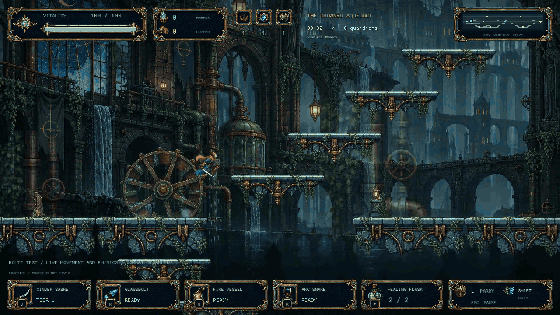
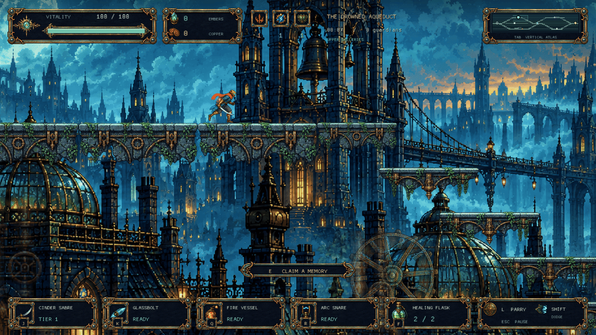
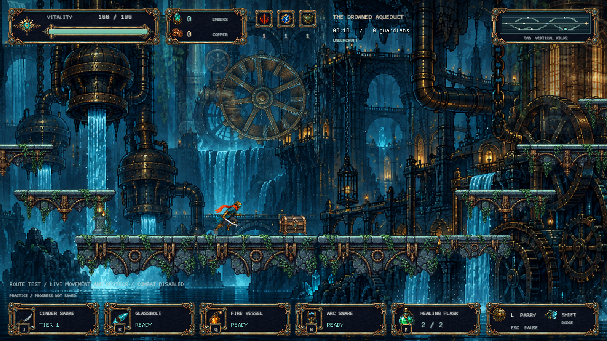
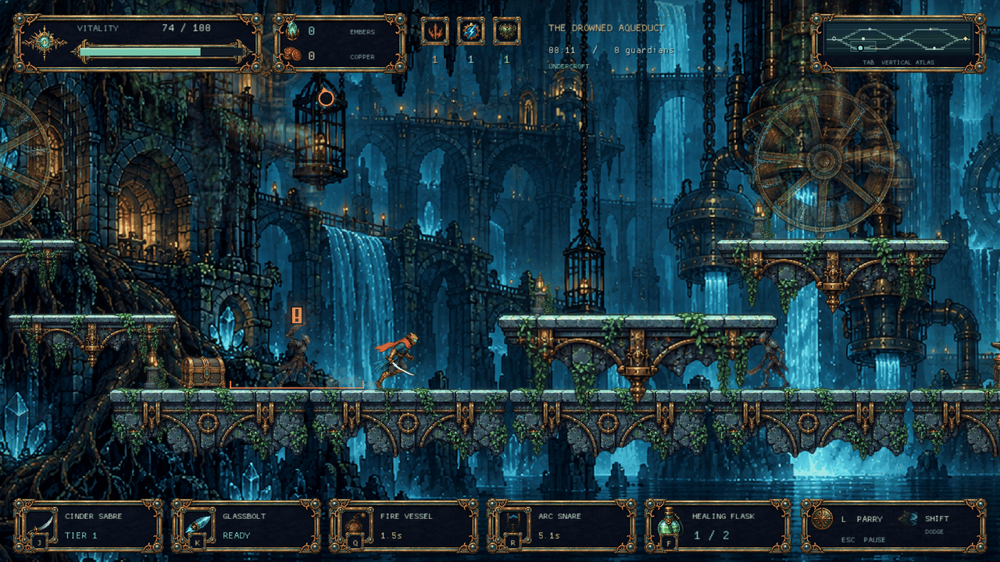
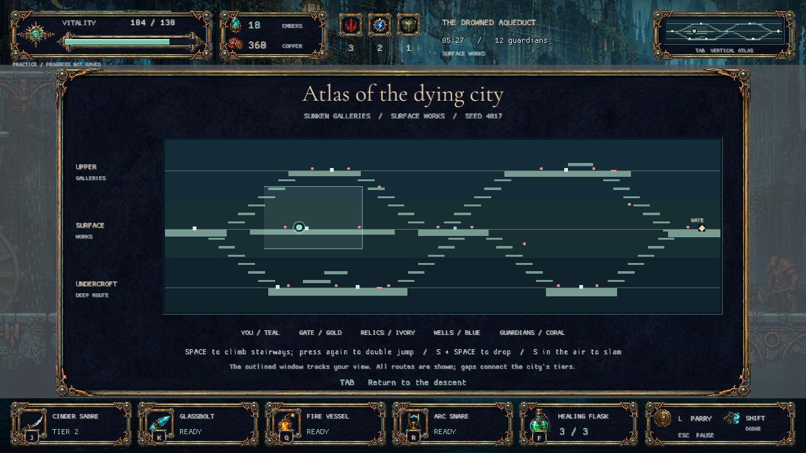
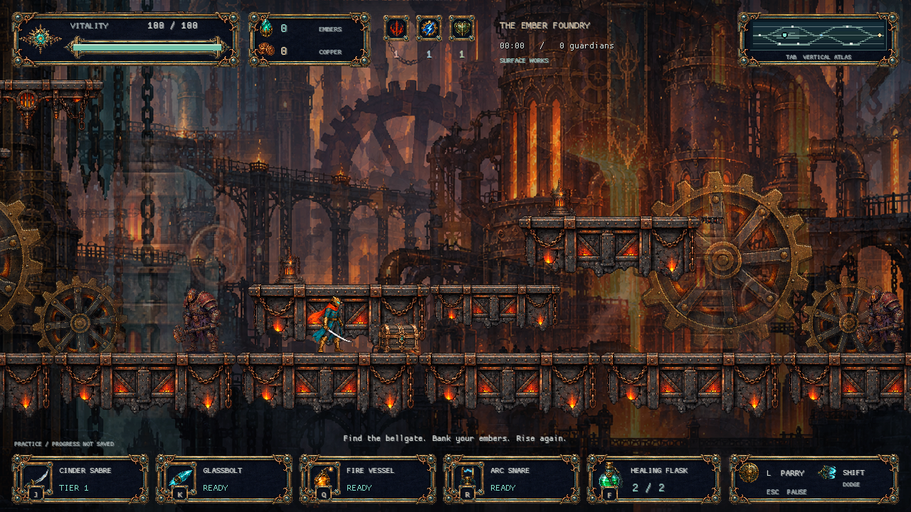
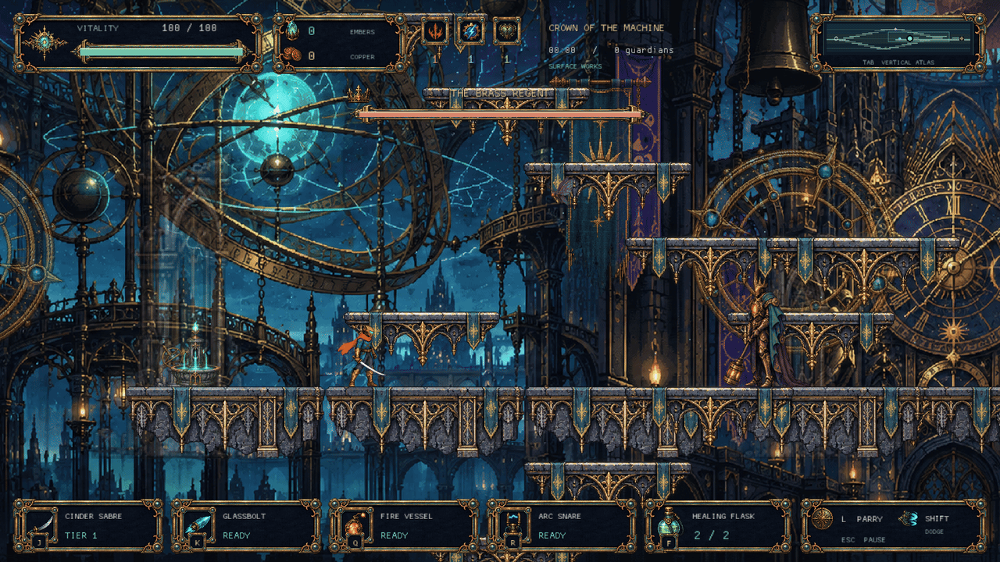
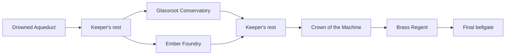

<div align="center">

# Cinderwake

**Carry the last fragment of a broken sun.**

A clockwork action roguelite, built in Rust.<br>
Climb the ruined city. Descend beneath it. Silence the Brass Regent.

[](https://www.rust-lang.org/)
[](https://macroquad.rs/)
[](LICENSE)
[](#project-status)
[](https://github.com/nearbycoder/Cinderwake/actions/workflows/ci.yml)

[Play](#play) · [Explore the city](#a-city-with-depth) · [Controls](#controls) · [Engine notes](docs/ENGINE.md)

</div>

<p align="center">
  <a href="https://github.com/nearbycoder/Cinderwake/raw/refs/heads/main/docs/media/cinderwake-demo.mp4"></a>
</p>

<p align="center"><strong><a href="https://github.com/nearbycoder/Cinderwake/raw/refs/heads/main/docs/media/cinderwake-demo.mp4">Download the full gameplay demo · MP4 · 40 seconds</a></strong></p>

The **40-second demo** opens with 15 seconds of scripted combat using live physics, followed by a full vertical traversal. The traversal segment disables enemies and hazards so the route is visible; normal play includes both. The preview above is a navigation excerpt. The edit uses Cinderwake's original ambient music; see [capture details](docs/media/README.md).

You are a small brass automaton in a city of copper, glass, and failing machinery. Fight across upper galleries, surface works, and buried chambers; collect equipment and memories; then carry your embers to the next bellgate before the city claims them back.

## What you can play

- **Responsive combat.** Chain melee strikes, reflect projectiles with directional parries, dodge through danger, fire glassbolts, throw fire vessels, and deploy arc snares.
- **Three elevations to explore.** Double jump into upper galleries, drop through ledges into the undercroft, and find connected routes back to the surface. A two-axis camera and full-height atlas follow the journey.
- **A branching run.** Four biome themes, three stages per run, four guardian types, and a final fight against the Brass Regent.
- **Choices that carry weight.** Three melee weapons, weapon tiers and scorching upgrades, three stat disciplines, two run mutations, copper forging, and permanent vitality and flask upgrades.
- **A city in motion.** Layered panoramas change with horizontal progress and elevation. Waterwheels turn, cloth sways, steam rises, and each biome has its own atmosphere.
- **Detailed pixel presentation.** Generated sprite sheets, action-synchronized animation, dodge afterimages, hit stop, camera shake, event-driven particles, selective bloom, and dynamic combat lighting. The HUD remains crisp above the effects.

## A city with depth

Every biome connects **upper galleries → surface works → undercroft** through stairways, platforms, gaps, and drop shafts. Backtracking is possible; elevation changes both the route and the backdrop. Layouts are authored, with seeded enemy and reward variation.

| Biome | The journey |
| --- | --- |
| **Drowned Aqueduct** | Flooded galleries, waterwheels, and the city's old pumpworks. Every run begins here. |
| **Glassroot Conservatory** | Glass cloisters, overgrown roots, and a moonlit rotunda. One branch from the first bellgate. |
| **Ember Foundry** | Chain lifts, crucibles, and the turbine heart. The other branch. |
| **Crown of the Machine** | High bridges and celestial machinery, watched over by the Brass Regent. |

<table>
  <tr>
    <td><a href="docs/media/rooftops.png"></a><br><strong>Above the city</strong><br>Climb into the upper galleries.</td>
    <td><a href="docs/media/undercroft.png"></a><br><strong>Below the surface</strong><br>Explore the undercroft and return through connected shafts.</td>
  </tr>
  <tr>
    <td><a href="docs/media/combat.png"></a><br><strong>Clockwork combat</strong><br>Sprite animation, impact effects, and selective bloom.</td>
    <td><a href="docs/media/atlas.png"></a><br><strong>Read the whole route</strong><br>The atlas surveys all three elevations.</td>
  </tr>
  <tr>
    <td><a href="docs/media/foundry.png"></a><br><strong>The Ember Foundry</strong><br>Machinery, fire, and drifting sparks.</td>
    <td><a href="docs/media/crown.png"></a><br><strong>Crown of the Machine</strong><br>The Regent's final domain.</td>
  </tr>
</table>

Screenshots come from the game renderer; staged gallery views are included alongside gameplay captures.

## Play

Install the [Rust toolchain](https://www.rust-lang.org/tools/install), then:

```sh
git clone https://github.com/nearbycoder/Cinderwake.git
cd Cinderwake
cargo run --release --locked
```

Press **Enter** to begin. All runtime art, fonts, shaders, and audio are embedded in the executable; no asset download or external game service is required.

**Verified platforms:** macOS on Apple Silicon, and Linux (CachyOS on Wayland through XWayland, AMD Radeon graphics, with 1.25× display scaling). Windows has not been tested. On other Linux distributions you may need the X11, OpenGL, and ALSA development packages that Macroquad depends on.

To build a local macOS app:

```sh
./scripts/package-macos.sh
open dist/Cinderwake.app
```

The script produces an ad-hoc signed app for local use, not a notarized public release.

### In a browser (experimental)

```sh
./scripts/build-web.sh
python3 -m http.server -d dist/web 8080   # then open http://localhost:8080
```

The browser build is a single WebAssembly file of about 49 MB, because all the art is embedded. Progress is kept in the browser's `localStorage`. It has been tested only in headless Chrome on Linux, at 1× and 1.25× pixel ratios: the title screen, starting a run, movement, the atlas, pausing, and keeping progress across a reload. Frame rate, sound, Firefox, Safari, and mobile browsers have not been checked. No hosted version is published.

See [build and verification notes](docs/ENGINE.md#build-and-verification) for more detail.

## A run, from first spark to final bell



1. **Explore and equip.** Chests immediately replace your melee weapon with an upgraded random weapon. Memories raise Ferocity, Ingenuity, or Resolve. Wells restore health and flasks; forges temper your weapon for copper.
2. **Reach a bellgate.** Carried embers are banked when you leave a biome. At the Keeper's rest, spend them on permanent vitality, flask capacity, or a mutation for the current run.
3. **Choose your branch.** Take the Conservatory or the Foundry, then continue to the Crown.
4. **Defeat the Regent.** The boss unlocks the Crown Rune; the final gate completes the run. Later runs scale enemy health with recorded victories.

Death resets equipment, run stats, and carried embers. Banked embers, permanent upgrades, the Crown Rune, and victory counts survive. Sealed caches open after eight guardian kills or with the rune on a later run.

Progress is stored in `progress.json` in your per-user data folder:

| Platform | Location |
| --- | --- |
| macOS | `~/Library/Application Support/Cinderwake/` |
| Linux | `$XDG_DATA_HOME/cinderwake/` (usually `~/.local/share/cinderwake/`) |
| Windows | `%APPDATA%\Cinderwake\` (not yet tested on Windows) |

Move that file aside to reset progression. Options are saved next to it in `settings.json`. On Linux, a save left at the old macOS-style path by earlier builds is still read until a new one is written. Capture and practice modes do not read or write your save.

## Controls

| Input | Action |
| --- | --- |
| **A / D** or **← / →** | Move; choose a route at the Keeper's rest |
| **Space / W / ↑** | Jump; press again for a double jump |
| **S / ↓ + Space** on a ledge | Drop through that ledge |
| **S / ↓** while falling | Ground slam |
| **J** or **left mouse** | Melee combo; hold to repeat |
| **K** | Fire glassbolt |
| **Shift** | Dodge with brief invulnerability |
| **L** or **right mouse** | Directional parry; reflect projectiles |
| **Q** / **R** | Throw fire vessel / place arc snare |
| **F** | Drink a flask; damage interrupts healing |
| **E** | Interact |
| **1 / 2 / 3** | Choose a memory or Keeper upgrade |
| **Enter** | Start, continue, or restart |
| **Tab** | Show the vertical atlas |
| **Escape** | Pause and controls |
| **O** | Options, from the title or pause screen |
| **X** twice | Abandon the run, from the pause screen |
| **M** | Mute / unmute |
| **F9** | Toggle world lighting and bloom |
| **F11** | Fullscreen |
| **F12** | Save a screenshot to `captures/` |

## Inside the engine

Cinderwake uses a **custom game framework on Macroquad**. Rust owns the fixed-step simulation, platform physics, combat, AI, progression, animation, rendering composition, and tools. Macroquad supplies the window, input, GPU drawing, and audio backends.

| System | Approach |
| --- | --- |
| Simulation | 120 Hz fixed step; seeded generation; presentation separated from gameplay randomness |
| World | Authored three-tier routes; one-way platforms; two-dimensional camera; route and support validation |
| Animation | 32 selected hero frames, 32 guardian frames, and eight Regent frames; movement-driven strides and simulation-timed actions |
| Particles | A bounded pool of 512 particles; sparks, debris, smoke, dust, motes, shockwaves, and flashes |
| Rendering | 640 × 360 world coordinates rendered at 1280 × 720, with nearest-neighbor sampling |
| Post-processing | Separable selective bloom, biome grading, vignette, and up to eight dynamic combat lights; unfiltered fallback |
| Persistence | Version-tolerant JSON; atomic file replacement; isolated practice modes |

The [engine guide](docs/ENGINE.md) includes the source map, rendering pipeline, asset workflow, save behavior, verification commands, and reproducible capture modes.

## Project status

**A playable prototype under active development.** The core run loop, vertical exploration, combat, progression, and visual systems are implemented. This is an original project inspired by the action-roguelite genre, not a claim of feature parity with Dead Cells.

The current scope is deliberately visible: one final boss, an authored route structure, a small equipment pool, shared blade artwork across melee weapons, and reused poses for some skills. An options page covers music and effects volume, screen-shake intensity, hit-stop, reduced flashes, and lighting; those choices are saved separately from progress. Gamepad support, control rebinding, broader accessibility options, localization, broader progression, and production-level balancing are not implemented. The atlas is a complete survey, without fog of war. See [current boundaries](docs/ENGINE.md#current-boundaries).

To check a change locally:

```sh
cargo test --locked
cargo clippy --locked --all-targets -- -D warnings
cargo fmt --check
```

Tests cover physics, combat, progression, animation timing, effects, and multi-biome route traversal. Rendered captures provide a separate visual check; passing tests alone does not establish visual quality or exhaustive playability.

## Art, audio, and credits

The setting, characters, encounters, generated artwork, and synthesized audio are original. No Dead Cells assets or source code are used. [Dead Cells](https://en.wikipedia.org/wiki/Dead_Cells) was the initial genre and feel reference.

- **Artwork:** created with the built-in ImageGen tool. Original PNG outputs and prompts are retained for [characters](assets/sprites/PROMPTS.md), [environments](assets/environment/PROMPTS.md), [panoramas and animated scenery](assets/environment/MOTION-PROMPTS.md), [vertical backdrops](assets/environment/DEPTH-PROMPTS.md), and [interface elements](assets/ui/PROMPTS.md).
- **Audio:** original synthesized ambience and nine effects; regenerate with `python3 scripts/synthesize.py`.
- **Font:** Cormorant Garamond, under the [SIL Open Font License](assets/FONT-LICENSE.txt).
- **Code and generated artwork/audio:** [MIT](LICENSE). Macroquad and other dependencies retain their respective licenses.

<div align="center">
<sub>Built with Rust, brass, glass, and one remaining spark.</sub>
</div>
