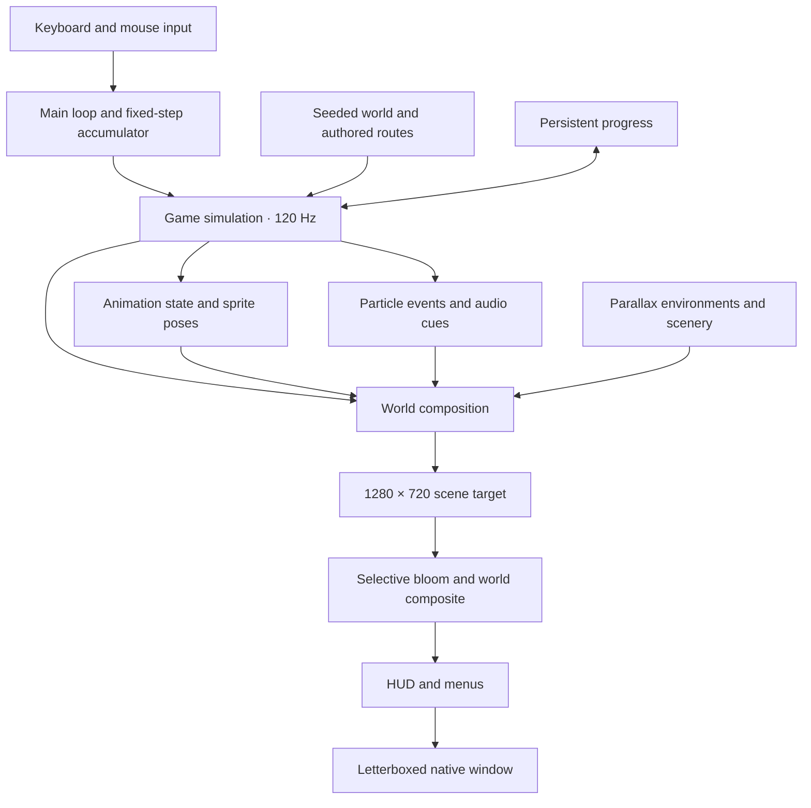

# Cinderwake — engine and development guide

[← Back to the game](../README.md)

Cinderwake is a standalone action roguelite and a custom Rust game framework on Macroquad. It has no editor or separate asset server: runtime assets are embedded at compile time, and game systems live in a compact set of Rust modules.

## Architecture



The simulation uses a 120 Hz fixed step independently of render cadence. Animation actions follow simulation timers, and visual effects use their own random stream so changing particle emission does not change gameplay randomness. Pause, memory-selection, and Keeper screens freeze world motion and discard pending gameplay inputs. New levels receive a short arrival fade.

### Source map

| File | Responsibility |
| --- | --- |
| [`src/main.rs`](../src/main.rs) | Native window, input, fixed-step accumulator, menus, presentation, arrival fade, profiling, and capture modes |
| [`src/world.rs`](../src/world.rs) | Reproducible PRNG, biome definitions, authored route assembly, platforms, actors, rewards, and support queries |
| [`src/game.rs`](../src/game.rs) | Player physics, collision, combat, enemy AI, projectiles, inventory, run state, and transitions |
| [`src/traversal_capture.rs`](../src/traversal_capture.rs) | Normal-input route follower and multi-biome traversal regression checks |
| [`src/animation.rs`](../src/animation.rs) | Hero states, timer-synchronized action frames, movement-driven strides, landing and hurt reactions |
| [`src/art.rs`](../src/art.rs) | Character sheets, directional drawing, enemy motion and attack animation, and sprite preview |
| [`src/atlas.rs`](../src/atlas.rs) | Connected silhouette extraction, cross-cell weapon preservation, and runtime sprite anchors |
| [`src/particles.rs`](../src/particles.rs) | Typed event effects, bounded particle storage, visual randomness, particle physics, and drawing |
| [`src/environment.rs`](../src/environment.rs) | Biome plates and panoramas, region names, elevation blending, terrain, scenery, atmosphere, and props |
| [`src/scenery.rs`](../src/scenery.rs) | Transient pixel-flame effects |
| [`src/render.rs`](../src/render.rs) | World composition, combat effects, and camera-relative drawing |
| [`src/postprocess.rs`](../src/postprocess.rs) | Bloom targets, world grading, combat lights, and unfiltered fallback |
| [`assets/shaders/`](../assets/shaders/) | Fullscreen vertex shader, bloom fragment shader, and composite fragment shader |
| [`src/ui.rs`](../src/ui.rs) | HUD, interaction prompts, atlas, title screen, and menus |
| [`src/ui_skin.rs`](../src/ui_skin.rs) | Generated UI atlas, nine-slice frames, gauges, icons, and crest |
| [`src/audio.rs`](../src/audio.rs) | Embedded audio, effect dispatch, and music controls |
| [`src/save.rs`](../src/save.rs) | Version-tolerant JSON progress |
| [`src/storage.rs`](../src/storage.rs) | Per-platform data directory and atomic file replacement |

Macroquad provides windowing, graphics, input, and audio. Cinderwake does not implement its own low-level graphics backend.

## World and movement

Each biome has an authored surface route, upper galleries, and undercroft. Gallery and undercroft landings are 336 world units above and below the surface baseline. Seven-step flights connect tiers using overlapping ledges with wide landings. Normal biomes span 3,600 world units; the Crown spans 1,500.

Enemy and reward variations are seeded. The route structure is authored rather than an unrestricted procedural room graph. `Level::support_at` finds real landing surfaces beneath a position; route tests verify that the tiers and exits are reachable and returnable across seeds.

Movement includes acceleration, variable-height double jumping, coyote time, jump buffering, one-way platforms, a deliberate ledge drop-through, and aerial ground slam. The camera follows both axes. Rendering, interaction ranges, particles, lights, and the atlas account for elevation.

The atlas is a full survey showing platforms, objects, guardians, hazards, bellgates, and the current camera footprint. It has no fog of war.

## Combat and progression

- **Weapons:** sabre, glaive, and hammer have different damage, reach, and delays. They share the hero's blade artwork. Chests choose a replacement weapon and increase its tier; the forge spends copper to increase the tier.
- **Actions:** three-hit melee combo, glassbolts, directional parry and projectile reflection, dodge invulnerability, explosive fire vessels, damaging arc snares, and ground slam.
- **Enemies:** wardens, archers, moths, brutes, and the Brass Regent. Behavior includes attack windups, stagger, burn damage, and boss melee/projectile patterns.
- **Memories:** Ferocity raises melee damage; Ingenuity raises ranged and grenade damage; Resolve emphasizes maximum health. Every memory also raises maximum health.
- **Resources:** copper is spent during a run; carried embers are banked at bellgates. Wells refill health and flasks. Damage interrupts flask healing.
- **Keeper:** banked embers buy permanent vitality, permanent flask capacity, or one of two mutually exclusive run mutations. Mending heals three vitality per kill; Swift Skills makes grenade and snare cooldowns tick 35% faster. Buying a mutation again switches the active one.
- **Victory:** defeating the Regent grants the Crown Rune; using the final gate records a win. Wins increase enemy health in later runs. The rune bypasses the eight-kill requirement on sealed caches; it is not a traversal ability.

The route is Aqueduct → Conservatory **or** Foundry → Crown, with a Keeper stop between stages. Death discards carried embers, equipment, and run stats. Permanent upgrades, banked embers, the rune, and recorded run statistics persist.

### Save behavior

Progress lives in `progress.json` inside the per-user data directory chosen by [`src/storage.rs`](../src/storage.rs):

```text
macOS    ~/Library/Application Support/Cinderwake/
Linux    $XDG_DATA_HOME/cinderwake/   (falls back to ~/.local/share/cinderwake/)
Windows  %APPDATA%\Cinderwake\
```

The schema uses defaults for missing fields. Saving writes a temporary JSON file and renames it over the prior file; unreadable or invalid saves currently fall back to default progress. To reset a save, move the file aside before launching.

Earlier builds used the macOS path on every platform. If no save exists at the new location, the old one is read, and the next save is written to the new location. The Linux path was verified by launching the release build with a temporary `XDG_DATA_HOME`; the Windows path is covered by unit tests only. Practice, gallery, and capture modes neither read nor write progression.

## Animation and rendering

The world uses 640 × 360 logical coordinates and is rendered into a 1280 × 720 target before nearest-neighbor scaling and letterboxing. Animation and effects retain discrete pixel detail while physics runs at 120 Hz.

The letterboxed frame is computed in logical window units, while the HUD camera's viewport is converted to physical framebuffer pixels with the display scale factor. This keeps the HUD and menus aligned with the world on fractional (for example 1.25×) and Retina-style displays; it was verified at 1.25× on Linux, including a non-16:9 window.

### Characters

The runtime selects 32 hero frames, 32 guardian frames, and eight Regent frames from the generated source sheets. Atlas extraction preserves connected silhouettes, including weapons that extend beyond a source cell, and uses consistent sprite anchors.

Hero action frames follow combat timers, including hit stop. Run strides accumulate actual movement; enemy walking similarly uses displacement rather than distance from spawn. Enemy telegraphs, strikes, recovery, and stun each influence the pose. Pausing freezes animation.

Sole-anchored landing compression, takeoff stretch, attack follow-through, and recoil add motion between source frames. Dodge afterimages keep their sampled world position, facing, frame, and pose. Hit flashes preserve silhouettes, and invulnerability leaves the hero visible. Ranged shots, throws, trap placement, and slams reuse existing poses rather than having dedicated new sprite artwork.

### Environments

Four opening plates blend into four wider biome panoramas as the camera crosses a level. The panorama advances with spatial progress instead of looping a backdrop seam. Each biome has three named horizontal regions. Separate rooftop and undercroft plates blend with camera elevation and vertical parallax.

Sixteen modular terrain/decorative pieces, eight interactive-prop variants, and eight mechanism/effect sprites support the scenery. Waterwheels, gears, and clock rings rotate; cloth and branches sway; mist, steam, leaves, fire, rain, sparks, and motes move independently of the combat layer. Wells, forges, and gates have animated accents.

### Particles and post-processing

A bounded pool of 512 particles handles sparks, bouncing debris, dust, smoke, motes, rings, and flashes. Events distinguish hits, deaths, movement, takeoff, landings, dodges, parries, healing, projectiles, loot, and explosions. A separate visual PRNG keeps particle changes from altering gameplay outcomes.

World post-processing has two stages:

1. **Selective bloom:** bright pixels are blurred through separate horizontal and vertical render targets.
2. **Composite:** the original nearest-sampled scene receives the bloom, biome color grading, a restrained vignette, and up to eight dynamic combat lights.

The HUD is drawn after the world effects. Shader compilation failure falls back to the unfiltered scene. **F9** toggles post-processing in interactive play; `--no-postfx` disables it at launch, including in capture modes.

### Interface and sound

Generated frame, icon, and crest atlases provide nine-slice panels, gauges, equipment slots, and plaques around live game state. The UI covers title, combat HUD, map, low health, cooldowns, pause, memory selection, Keeper purchases/routes, death, victory, and boss health.

Original synthesized ambient music and nine effects are embedded with the artwork, font, and shaders. Regenerate audio with `python3 scripts/synthesize.py`. The soundtrack is a prototype soundscape, not a finished production score.

## Build and verification

From the repository root, with Rust and Cargo installed:

```sh
cargo run --release --locked
cargo test --locked
cargo clippy --locked --all-targets -- -D warnings
cargo fmt --check
```

If Cargo is missing from your shell's PATH but installed with rustup, use `~/.cargo/bin/cargo`.

For a macOS app bundle:

```sh
./scripts/package-macos.sh
open dist/Cinderwake.app
```

The script builds the release executable, creates `dist/Cinderwake.app`, includes the MIT and font license notices, and ad-hoc signs it. It does not notarize, publish, or distribute the app. Only macOS Apple Silicon has been built and visually checked for this project; other platforms require their own build and runtime validation.

The [Rust checks workflow](../.github/workflows/ci.yml) runs formatting, strict Clippy, and tests on GitHub's macOS runner. It does not launch the graphical game or replace visual runtime checks.

Regression tests cover physics and combat behavior, save compatibility, progression transitions, animation timing, particle limits and independence, lighting/camera alignment, and multi-biome navigation. Capture modes exercise actual rendering separately from the tests. Neither a capture nor a passing suite establishes that every human-played route or hardware configuration is defect-free.

## Verification and capture

Run capture commands from the repository root. Outputs are written beneath `captures/` relative to the working directory. Raw capture output, build artifacts, and local app bundles are not intended as source assets; the curated README media is retained under [`docs/media/`](media/).

| Mode | What it runs | Output |
| --- | --- | --- |
| `--capture` | A deterministic 15-second input script through normal simulation | `captures/frame-*.png`, roughly 10 frames per simulated second |
| `--demo` | Continuous scripted practice play | Runs until closed |
| `--gallery` | Four staged biome views | `captures/biome-0.png` through `biome-3.png` |
| `--sprite-preview` | Eight hero animation panels | `captures/animation-preview.png` |
| `--ui-gallery` | Eleven frozen, fixed-seed interface fixtures | `captures/ui-*.png` |
| `--environment-tour` | 24 seconds of camera traversal across all four biomes | 480 PNGs at 20 fps in `captures/tour/` |
| `--motion-capture` | 15 seconds of scripted input with live physics and combat | 300 PNGs at 20 fps in `captures/motion/` |
| `--vertical-capture` | A complete fixed-seed Aqueduct route through all elevations | 20 PNGs per simulated second in `captures/vertical/`; about 25 seconds |

Examples:

```sh
cargo run --release --locked -- --motion-capture
cargo run --release --locked -- --vertical-capture
cargo run --release --locked -- --environment-tour
cargo run --release --locked -- --ui-gallery
cargo run --release --locked -- --sprite-preview
```

All these modes isolate themselves from your saved progression. Gallery modes are staged fixtures, not gameplay recordings. The environment tour removes enemies and moves the camera while holding normal gameplay still.

The motion capture starts at reduced health to show healing, then exercises movement, double jump, slam, dodge, melee, parry, glassbolts, grenades, and snares. It demonstrates the actions rather than exhaustively testing every animation transition.

The vertical capture follows ordinary movement, jump, and drop-through inputs from surface to upper galleries, back to surface, into the undercroft, and up to the bellgate. Physics, collision, camera, and animation remain active; enemies and hazards are removed to show the full route. It holds the finished route for one second, reports waypoint completion, and exits. A 90-second timeout stops stalled captures.

Capture directories are reused on subsequent runs. Keep separate copies when comparing versions or shader settings. Videos in the README are edited from capture output; they are not recorded human playthroughs.

### Compare shaders and CPU submission cost

```sh
cargo run --release --locked -- --motion-capture --profile-render
cargo run --release --locked -- --motion-capture --profile-render --no-postfx
```

`--profile-render` reports mean and 95th-percentile CPU simulation/draw-submission time after a finite capture. It excludes the first 60 frames, screenshot readback, and vertical-sync waits. These figures are **CPU submission measurements**, not GPU frame time or measured gameplay FPS.

## Asset provenance

The PNGs were created with the built-in ImageGen tool. Source outputs remain unchanged; runtime import handles extraction and anchoring. The selected hero sheet is `wanderer-v2.png`; `wanderer-v1.png` is retained as an earlier iteration.

| Collection | Source and generation notes |
| --- | --- |
| Hero, guardians, Regent | [`assets/sprites/PROMPTS.md`](../assets/sprites/PROMPTS.md) |
| Opening backdrops, terrain, props | [`assets/environment/PROMPTS.md`](../assets/environment/PROMPTS.md) |
| Four wide panoramas and animated mechanisms | [`assets/environment/MOTION-PROMPTS.md`](../assets/environment/MOTION-PROMPTS.md) |
| Rooftop and undercroft depth plates | [`assets/environment/DEPTH-PROMPTS.md`](../assets/environment/DEPTH-PROMPTS.md) |
| UI frames, icons, and crest | [`assets/ui/PROMPTS.md`](../assets/ui/PROMPTS.md) |
| Synthesized audio | [`scripts/synthesize.py`](../scripts/synthesize.py) |

Code and generated artwork/audio use the [MIT license](../LICENSE). Cormorant Garamond uses the [SIL Open Font License](../assets/FONT-LICENSE.txt). Dependencies retain their own licenses. Dead Cells informed the genre and feel; no assets or source code from it are included.

## Current boundaries

This is a playable prototype, with these limits visible in the current implementation:

- Authored three-tier layouts and a single two-way biome branch, rather than a procedural room graph or a large branching world.
- Three melee weapons, a small skill set, shared melee artwork, and reused animation poses for some actions.
- One final boss, one ending, and a limited mutation and upgrade economy. No blueprint unlock tree, extensive affixes/synergies, or traversal-rune progression.
- A complete atlas without fog of war; no challenge modes or DLC systems.
- Keyboard/mouse controls without gamepad support or rebinding; no localization or extensive accessibility settings.
- macOS Apple Silicon and Linux verification only, and local ad-hoc macOS packaging without notarization.
- Prototype audio, balancing, encounter variety, and animation coverage. Visual captures and automated tests are complementary checks, not a guarantee of zero defects.

See the [README](../README.md) for the playable features, controls, screenshots, and demo.
