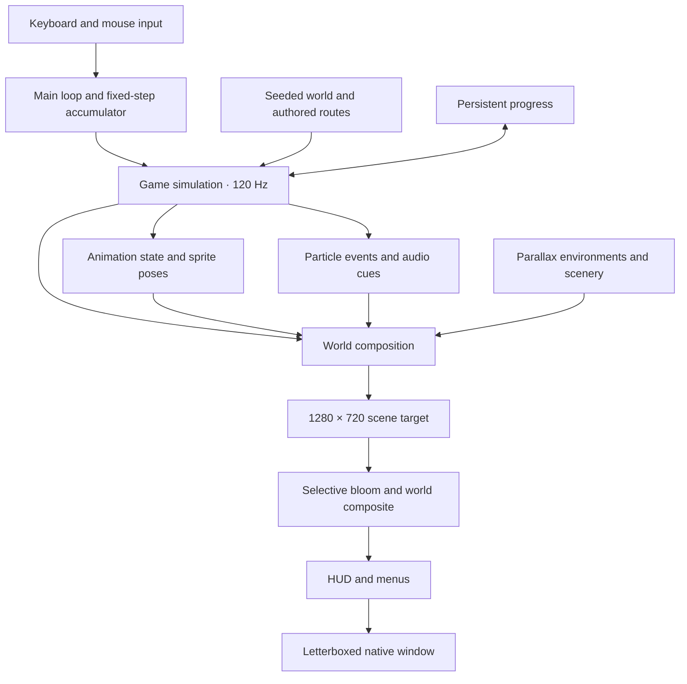

# Cinderwake — engine and development guide

[← Back to the game](../README.md)

Cinderwake is a standalone action roguelite and a custom Rust game framework on Macroquad. It has no editor or separate asset server: runtime assets are embedded at compile time, and game systems live in a compact set of Rust modules.

## Architecture



The simulation uses a 120 Hz fixed step independently of render cadence. Animation actions follow simulation timers, and visual effects use their own random stream so changing particle emission does not change gameplay randomness. Pause, options, memory-selection, and Keeper screens freeze world motion and discard pending gameplay inputs. New levels receive a short arrival fade.

### Source map

| File | Responsibility |
| --- | --- |
| [`src/main.rs`](../src/main.rs) | Native window, input, fixed-step accumulator, menus, presentation, arrival fade, profiling, and capture modes |
| [`src/world.rs`](../src/world.rs) | Reproducible PRNG, biome definitions, authored route assembly, platforms, actors, rewards, and support queries |
| [`src/game.rs`](../src/game.rs) | Player physics, collision, combat, enemy AI, projectiles, inventory, run state, and transitions |
| [`src/launch.rs`](../src/launch.rs) | `--start-at` testing shortcut: a practice run staged beside a chosen object |
| [`src/traversal_capture.rs`](../src/traversal_capture.rs) | Normal-input route follower and multi-biome traversal regression checks |
| [`src/animation.rs`](../src/animation.rs) | Hero states, timer-synchronized action frames, movement-driven strides, landing and hurt reactions |
| [`src/art.rs`](../src/art.rs) | Character sheets, directional drawing, enemy motion and attack animation, and sprite preview |
| [`src/atlas.rs`](../src/atlas.rs) | Connected silhouette extraction, cross-cell weapon preservation, and runtime sprite anchors |
| [`src/particles.rs`](../src/particles.rs) | Typed event effects, bounded particle storage, visual randomness, particle physics, and drawing |
| [`src/environment.rs`](../src/environment.rs) | Biome plates and panoramas, region names, elevation blending, terrain, scenery, atmosphere, and props |
| [`src/scenery.rs`](../src/scenery.rs) | Transient pixel-flame effects |
| [`src/render.rs`](../src/render.rs) | World composition, combat effects, attack warnings, and camera-relative drawing |
| [`src/postprocess.rs`](../src/postprocess.rs) | Bloom targets, world grading, combat lights, and unfiltered fallback |
| [`assets/shaders/`](../assets/shaders/) | Fullscreen vertex shader, bloom fragment shader, and composite fragment shader |
| [`src/ui.rs`](../src/ui.rs) | HUD, interaction prompts, atlas, title screen, menus, and their click targets |
| [`src/ui_skin.rs`](../src/ui_skin.rs) | Generated UI atlas, nine-slice frames, gauges, icons, and crest |
| [`src/audio.rs`](../src/audio.rs) | Embedded audio, effect dispatch, per-scene music choice, and crossfades |
| [`src/save.rs`](../src/save.rs) | Version-tolerant JSON progress, the run checkpoint, and keeping unreadable files aside |
| [`src/settings.rs`](../src/settings.rs) | Saved player options: volume, shake, hit-stop, flash reduction, lighting, mute, fullscreen, seen tips, game speed, and key bindings |
| [`src/controls.rs`](../src/controls.rs) | Rebindable gameplay actions, the bindable-key table, input gathering, and prompt names for keys or controller buttons |
| [`src/pad.rs`](../src/pad.rs) | Controllers: the fixed layout, stick dead zone, menu directions, connection changes, and the `gilrs` (desktop) and Gamepad API (browser) readers |
| [`src/icon.rs`](../src/icon.rs) | The desktop window icon, cut from the interface crest at launch |
| [`src/storage.rs`](../src/storage.rs) | Per-platform data directory, atomic file replacement, and browser `localStorage` |
| [`web/`](../web/) | Browser page, storage plugin, and controller plugin used by `scripts/build-web.sh` |

Macroquad provides windowing, graphics, input, and audio. Cinderwake does not implement its own low-level graphics backend.

## World and movement

Each biome has an authored surface route, upper galleries, and undercroft. Gallery and undercroft landings are 336 world units above and below the surface baseline. Seven-step flights connect tiers using overlapping ledges with wide landings. Normal biomes span 3,600 world units; the Crown spans 1,500.

Enemy and reward variations are seeded. The route structure is authored rather than an unrestricted procedural room graph. `Level::support_at` finds real landing surfaces beneath a position; route tests verify that the tiers and exits are reachable and returnable across seeds.

Movement includes acceleration, variable-height double jumping, coyote time, jump buffering, one-way platforms, a deliberate ledge drop-through, and aerial ground slam. The camera follows both axes. Rendering, interaction ranges, particles, lights, and the atlas account for elevation.

The atlas (**Tab**) and the HUD minimap show platforms, objects, guardians, hazards, bellgates, and the current camera footprint, under a fog of war. `world::Survey` divides each level into 80 × 62 world-unit cells and marks every cell the camera shows, each tick. Platforms are drawn only along their seen stretches, unseen cells are darkened, and guardians, hazards, and relics appear only once seen. The bellgate is always marked, and the atlas header reports the share surveyed. Each biome starts dark apart from the spawn view. Practice, gallery, and capture modes keep the complete survey so their output is unchanged; the `ui-15-atlas-fog` fixture shows the fog.

## Combat and progression

- **Weapons:** sabre, glaive, and hammer have different damage, reach, and delays. They share the hero's blade artwork. Chests increase the tier and roll a weapon. If it differs from the one in hand, the world pauses on a reliquary choice showing each weapon's per-strike damage at the new tier, reach, and swing time: **1** takes it, **2** keeps the current weapon. The forge spends copper to increase the tier.
- **Actions:** three-hit melee combo, glassbolts, directional parry and projectile reflection, dodge invulnerability, explosive fire vessels, damaging arc snares, and ground slam.
- **Early presses:** a press of dodge, parry, fire vessel, or arc snare, or a fresh press of strike or glassbolt, made up to 0.15 s (`game::PRESS_BUFFER`) before that action is ready is kept (`Player::queued`) and happens on the step it becomes ready, once. "Ready" means its recovery has ended and, for strikes, any dodge or flask has finished. Earlier presses are dropped. Holding strike or glassbolt repeats exactly as before, and since only a fresh press is kept, releasing never adds a swing. Menus, travel, and the updraft discard kept presses. Jumping keeps its own 0.12 s buffer. Before round 10 only the jump was buffered, so a dodge pressed during the last moment of the 0.65 s dodge recovery, or a strike tapped as a dodge ended, did nothing. Tests press each action 0.1 s early (it happens as it becomes ready, once), 0.3 s early (dropped), and tap a strike during a dodge's last 0.1 s (it swings as the dodge ends); held sabre strikes still come every 33 steps, with none after release. The motion capture's 300 frames matched a build of `main` within the run-to-run variation recorded in round 9, so its scripted presses weren't early enough to change.
- **Refused presses on the HUD:** the parry and dodge badges dim and fill from the top while recovering, as the four slots already did. A press that can't happen even with the early-press buffer (its action is more than 0.15 s from ready), and a flask pressed with none left or at full vitality, outlines that slot in red for 0.45 s (`Player::refused`, `ui::Ui::refusal`), fading as it goes, and the flask reads **EMPTY** or **FULL** meanwhile. Holding strike or glassbolt through their recovery isn't a refusal, and a kept press that later happens marks nothing. With **Reduce flashes** on, the outline holds steady instead of fading. No sound is added. Before round 10, such a press looked the same as an unbound key, and the dodge and parry showed no recovery at all. Tests check that each refused action marks only its own slot and fades, that kept presses and held strikes mark nothing, and the flask's two reasons; the `ui-35-refused-presses` fixture shows the dodge recovering and a refused fire vessel and flask, and `ui-02` now shows the parry and dodge recovering.
- **Poise:** wardens, archers, and brutes are not staggered or pushed back by light hits (ordinary strikes and glassbolts), which still deal damage. Heavy hits (the second blow of each combo, slams, fire vessels, arc snares, parries, and reflected bolts) stagger and push them. Moths and the Regent react to every hit as before. A light hit landing on a guardian that is winding up shows a steel-coloured damage number: the strike is still coming, so dodge or parry. Before this change, every hit staggered and pushed guardians, so holding attack kept a single warden or brute out of reach indefinitely.
- **Enemies:** wardens, archers, moths, brutes, and the Brass Regent. Behavior includes attack windups, stagger, burn damage, and boss melee/projectile patterns.
- **Attack warnings:** while a guardian winds up (0.4 s, or 0.65 s for brutes and 0.62 s for the Regent), a mark over it brightens from amber to red as the attack nears. Wardens, brutes, and the Regent's lunge also mark their reach on the ground; an archer shows a dotted line along its aim, and the Regent's every third attack shows the fan of its five-bolt volley. Moths show only the mark, since they fly. The reach comes from `EnemyKind::strike_reach`, the same numbers the hit test uses, so the drawing can't drift from the damage (`strikes_land_only_inside_the_warned_reach` checks the edges). A short tell sound plays when a guardian on screen starts a windup, at most once every 0.2 s. Before round 6 the only warning was a 2 × 4 pixel mark and there was no sound. Timing and damage are unchanged; the `ui-25-attack-warnings` fixture shows a brute, a warden, and an archer mid-windup. Since round 8, a guardian that winds up, or a hostile bolt that flies toward the hero from within 420 units, outside the part of the view the HUD panels leave clear gets a marker on that edge of the play area (`render::threat_markers`): a disc on the line from the hero toward it, with an arrow pointing out. A windup's marker carries the same "!" and amber-to-red colour as its mark; a bolt's is smaller and plain. Markers closer than 24 pixels merge, keeping a windup's. They aren't drawn over the atlas or menus, and they disappear once the threat is in view. Before, archers (which aim from 300 units across and 200 up or down, while the view is 640 × 360 and the HUD covers its top and bottom strips) could shoot from above or below with no warning, and the tell stays silent for guardians off screen. The `ui-31-threats-out-of-view` fixture shows an archer above the view, a brute past the left edge, and a bolt arriving from above.
- **Low vitality:** at 30% vitality or less in play (atlas included), the screen's edges take a red tint under the HUD that pulses about once a second and strengthens as vitality falls (`render::low_vitality`), and the flask slot glows while a flask is left and none is being drunk. With **Reduce flashes** on, both hold steady. Before round 8, the only sign was the vitality bar turning red. The `ui-02` fixture shows the pulse at 15% with no flasks, and `ui-32-low-vitality-steady` shows 23% with a flask and flashes reduced. Before the Regent's arena, the Crown's upper gallery is guarded by an archer and a brute, with a moth over the arena gate.
- **Difficulty:** `world::Threat` scales enemies by stage and recorded wins. Guardians gain 45% health and 30% damage per stage (×1.9 health and ×1.6 damage in the Crown). The Regent, already tuned as the final fight, gains 30% health and 5% damage per stage (×1.6 and ×1.1). Each recorded win adds 12% health, as before. Previously, only wins scaled enemies, so the gear a run collects made later stages easier than the first.
- **Memories:** Ferocity raises melee damage; Ingenuity raises ranged and grenade damage; Resolve emphasizes maximum health. Every memory also raises maximum health.
- **Resources:** copper is spent during a run; carried embers are banked at bellgates. Wells refill health and flasks. Damage interrupts flask healing.
- **Keeper:** banked embers buy permanent vitality, permanent flask capacity, or one of two mutually exclusive run mutations. Mending heals three vitality per kill; Swift Skills makes grenade and snare cooldowns tick 35% faster. Buying a mutation again switches the active one.
- **Victory:** defeating the Regent grants the Crown Rune; using the final gate records a win. Wins increase enemy health in later runs, on top of the per-stage scaling. The rune bypasses the eight-kill requirement on sealed caches; it is not a traversal ability.

The route is Aqueduct → Conservatory **or** Foundry → Crown, with a Keeper stop between stages. A run in progress survives closing the game (see [save behavior](#save-behavior)). Death discards carried embers, equipment, and run stats. Permanent upgrades, banked embers, the rune, and recorded run statistics persist.

### Save behavior

Progress lives in `progress.json` inside the per-user data directory chosen by [`src/storage.rs`](../src/storage.rs):

```text
macOS    ~/Library/Application Support/Cinderwake/
Linux    $XDG_DATA_HOME/cinderwake/   (falls back to ~/.local/share/cinderwake/)
Windows  %APPDATA%\Cinderwake\
```

The schema uses defaults for missing fields. Three personal records live there too: `best_kills`, and since round 5 `best_stage` (the furthest stage reached, 0–2) and `best_time` (the fastest victory, in simulated seconds). Files from before round 5 lack the last two, so the first run afterwards records them without calling them new; a recap marks a record as new only when it beats one already saved, and practice runs never change records. Saving writes a temporary JSON file and renames it over the prior file. To reset a save, move the file aside before launching.

If `progress.json` or `settings.json` exists but can't be read, `save::load_json` copies its bytes to `progress.unreadable.json` (or `settings.unreadable.json`) before play continues on defaults, and the title screen names the file and the copy (the `ui-24-title-unreadable-save` fixture). Before round 6 the defaults were written straight back over the damaged file when the next run started, so one bad file lost every banked ember, upgrade, and victory without a word. A copy is never overwritten: a different damaged file later goes to `progress.unreadable-2.json` and so on, up to nine, and a file already kept with the same bytes isn't copied again (settings are written only when changed, so the same damaged file is found on every launch until then). Empty files count as missing. The browser build keeps its copies under the same names in `localStorage`. Damaged files can be repaired by hand and renamed back. In headless Chrome, damaged `progress.json` and `settings.json` entries in `localStorage` produced the notice and their `.unreadable.json` copies, and starting a run with **Enter** wrote fresh progress and left the copy intact. Checked with unit tests on the in-memory test storage and with the release build: launched with a truncated `progress.json` and a garbage `settings.json` in a temporary `XDG_DATA_HOME`, it showed the notice, kept both files byte for byte, and wrote fresh progress when a virtual controller started a run.

A run in progress is saved as `run.json` in the same folder (`cinderwake/run.json` in browser storage) by `save::Checkpoint`. It holds the run's seed, stage, biome, weapon, tier, memories, copper, mutation, maximum vitality, kills, and time, and whether it was saved at the Keeper. It's written on arrival in each biome, on reaching the Keeper, and after each Keeper purchase. It's deleted on death, abandoning, victory, and starting a new descent. If one exists at launch, the title offers **Enter** to continue and **N** to start again. Continuing regenerates the same level from the seed and stage and restores the build at full vitality and flasks, at the biome's start or on the Keeper screen. Embers carried since the last bellgate were never banked, so they're lost, as on death, and continuing doesn't count as a new descent. Quitting and continuing does restart the current biome from its entrance with the build you arrived with, so it can undo a bad fight; that is the usual trade-off for a save-on-arrival roguelite. A checkpoint that fails to parse, or names a stage and biome no run can reach, is ignored. Unit tests cover the round trip, every deletion path, practice isolation, and damaged files. In the browser build, with real key presses, an injected Keeper checkpoint continued to the Keeper, travelling saved the Foundry arrival, a reload offered and restored it, abandoning deleted it, and **N** replaced it.

In test builds, `storage` keeps files in a per-thread in-memory map, so no test can write to a real data folder. The desktop backend is tested directly.

Earlier builds used the macOS path on every platform. If no save exists at the new location, the old one is read, and the next save is written to the new location. The Linux path was verified by launching the release build with a temporary `XDG_DATA_HOME`; the Windows path is covered by unit tests only. Practice, gallery, and capture modes neither read nor write progression.

## Animation and rendering

The world uses 640 × 360 logical coordinates and is rendered into a 1280 × 720 target before nearest-neighbor scaling and letterboxing. Animation and effects retain discrete pixel detail while physics runs at 120 Hz.

### Drawing between steps

The simulation always advances in whole 120 Hz steps, but displays refresh at their own rates and frames never arrive exactly on time, so a frame usually falls between two steps. Until round 9 each frame drew the latest step, so at 144 or 165 Hz some frames repeated the one before while others moved a full step, and even at 60 or 120 Hz a frame arriving a fraction of a millisecond early or late did the same. Now, during play, [`src/blend.rs`](../src/blend.rs) records where the camera, the hero, guardians, and bolts were before each step (`Pose::record`), and the frame is drawn the leftover fraction of the way from there to where they are now (`Pose::show`, with `leftover` = time left over ÷ step). The real positions are put back as soon as the frame (world, lighting, and HUD) is drawn (`Pose::restore`), so the simulation, its inputs, and its outcomes never see a blended value. The view therefore lags the newest step by at most one step, 8.3 ms. Anything that moved more than 24 units in one step (travel, the updraft back to a safe ledge, a new level) is drawn where it landed. When a bolt is fired or ends during a step, the bolt list no longer lines up with the one recorded, so each bolt is drawn back along its velocity instead. Particles, floating numbers, and animation frames still advance with whole steps. Menus, staged views, the demo, and capture modes draw whole steps as before, so their output is unchanged.

Tests in `blend.rs` run a hero at full speed through the main loop's stepping at 60, 120 (with a ±0.5 ms wobble), 144, and 165 Hz: with blending, the drawn speed varies from frame to frame by less than 0.01%, and without it, some frames don't move at all. Other tests check that a teleport isn't blended, how a newly fired bolt is drawn, and that a 144 Hz run among the opening's guardians, blended every frame, ends in exactly the same state as one that isn't. Compared with a build of `main`, all 35 `--ui-gallery` fixtures and the 300 `--motion-capture` frames matched within the captures' own run-to-run variation (two runs of `main` differ the same way).

`--pacing-check` measures the problem on real hardware: it starts a practice run with nothing hostile, records 8 seconds of real frame times after a second's warm-up, prints how many whole steps each frame ran, how many frames repeated or skipped a step relative to the usual count, and how much the moment a frame shows wobbles when only whole steps are drawn, then exits. With blending, that wobble is zero by design, since each frame is drawn at its own moment less one step. In round 9 it ran four times inside a private nested KWin (see [test windows](#test-windows-in-a-private-compositor)), whose virtual output refreshes at about 60 Hz, at load averages of 20–28: frames usually ran two steps, and 4.6%, 7.9%, 18.8%, and 55.8% of them ran one, three, or none, which drawing whole steps would show as a repeated or skipped step; the shown moment wobbled by 1.8–2.2 ms on average. The busiest run had frame intervals from 6 to 34 ms (5th to 95th percentile). The desktop display here runs at 120 Hz, but the check wasn't run on it, to keep test windows off the shared desktop, and nobody has looked at the result on a 144 Hz monitor.

The letterboxed frame is computed in logical window units, while the HUD camera's viewport is converted to physical framebuffer pixels with the display scale factor. This keeps the HUD and menus aligned with the world on fractional (for example 1.25×) and Retina-style displays; it was verified at 1.25× on Linux, including a non-16:9 window.

### Characters

The runtime selects 32 hero frames, 32 guardian frames, and eight Regent frames from the generated source sheets. Atlas extraction preserves connected silhouettes, including weapons that extend beyond a source cell, and uses consistent sprite anchors.

Hero action frames follow combat timers, including hit stop. Run strides accumulate actual movement; enemy walking similarly uses displacement rather than distance from spawn. Enemy telegraphs, strikes, recovery, and stun each influence the pose. Pausing freezes animation.

Sole-anchored landing compression, takeoff stretch, attack follow-through, and recoil add motion between source frames. Dodge afterimages keep their sampled world position, facing, frame, and pose. Hit flashes preserve silhouettes, and invulnerability leaves the hero visible. Ranged shots, throws, trap placement, and slams reuse existing poses rather than having dedicated new sprite artwork.

### Environments

Four opening plates blend into four wider biome panoramas as the camera crosses a level. The panorama advances with spatial progress instead of looping a backdrop seam. Each biome has three named horizontal regions. Separate rooftop and undercroft plates blend with camera elevation and vertical parallax.

Sixteen modular terrain/decorative pieces, eight interactive-prop variants, and eight mechanism/effect sprites support the scenery. Waterwheels, gears, and clock rings rotate; cloth and branches sway; mist, steam, leaves, fire, rain, sparks, and motes move independently of the combat layer. Wells, forges, and gates have animated accents.

### Particles and post-processing

A bounded pool of 512 particles handles sparks, bouncing debris, dust, smoke, motes, rings, and flashes. Events distinguish hits, deaths, movement, takeoff, landings, dodges, parries, healing, projectiles, loot, and explosions. A separate visual PRNG keeps particle changes from altering gameplay outcomes.

World post-processing has two stages:

1. **Selective bloom:** bright pixels are blurred through separate horizontal and vertical render targets.
2. **Composite:** the original nearest-sampled scene receives the bloom, biome color grading, a restrained vignette, and up to eight dynamic combat lights.

The HUD is drawn after the world effects. Shader compilation failure falls back to the unfiltered scene. **F9** or the options page toggles post-processing in interactive play; `--no-postfx` disables it at launch, including in capture modes.

### Interface and sound

Generated frame, icon, and crest atlases provide nine-slice panels, gauges, equipment slots, and plaques around live game state. The UI covers title, combat HUD, map, low health, cooldowns, pause, memory selection, reliquary choices, Keeper purchases/routes, death, victory, and boss health.

The death and victory screens show a recap (`game::Recap`): what ended the run (`game::Cause`, recorded by `Game::hurt` from the guardian's strike or bolt, the spikes, or abandoning), the biome and stage, the weapon and tier, the memories and mutation, the embers lost or banked, and the records, with any this run beat marked **NEW**. For their first second (`RESULT_DELAY`) they ignore **Enter** and **A** and hide the button, so a button held or mashed as the hero falls doesn't skip into a new run. In headless Chrome, two **Enter** presses within 523 ms of abandoning were ignored, and a later press started a new run. The pause screen adds one line with the biome, stage, weapon, tier, and mutation.

Original synthesized music and seventeen effects are embedded with the artwork, font, and shaders. Regenerate audio with `python3 scripts/synthesize.py`. The soundtrack is a prototype soundscape, not a finished production score.

Effects cover guardian windups (the tell, added in round 6: two ratchet clicks over a rising whine, 0.22 s), strikes (with a heavier sound for each combo's third strike), hits, kills, jumps, dodges, parries, glassbolts, thrown fire vessels and arc snares, explosions, healing, pickups, banking at a bellgate or buying from the Keeper, menu choices (memories, reliquaries, Keeper routes, option changes, rebinding), and refusals (too few embers or copper, a sealed cache, the Regent's locked gate, a reserved key). Kills, glassbolts, thrown tools, banking, menus, and refusals were silent before round 3. `audio::effect_file` matches every `Sfx` cue to its file, so a cue can't compile without one, and a test checks that the files load in cue order. The effects synthesized in round 3, and the tell in round 6, use their own random streams, so earlier files regenerate byte for byte.

The score has five loops of 19–21 seconds in [`assets/music/`](../assets/music/): **hearth** (D minor, a fire's crackle) for the title, the Keeper, death, and victory; **aqueduct** (D dorian, water drips and a distant pump); **conservatory** (F lydian, glass chimes and wind); **foundry** (C phrygian, anvils, bellows, and a low ostinato); and **crown** (A harmonic minor, an organ and a ticking clock). `audio::Track::for_game` picks the loop for the current screen and biome; pause, options, memory, and reliquary screens keep the biome's music. Changing loops crossfades over 1.5 seconds on an equal-power curve, timed in real time so it continues while menus freeze the world. A loop that fades back in starts from its beginning. The music volume and mute options scale the whole mix.

Each loop is a whole number of bars rendered into a ring buffer: notes that ring past the end continue at the start, sustained drones complete a whole number of cycles per loop, and filtered noise runs twice around the ring so the seam matches. The synthesis script then checks every loop and fails if one clips, jumps at the seam by more than 99.9% of its sample-to-sample steps, or changes loudness by more than 2 dB in the half second around the seam. `python3 scripts/synthesize.py --check FILE...` runs only the checks. The single 16-second track used before round 3 faded out and back in at its seam, a 10.5 dB dip by this measure. The loops add 4.4 MB of 22 kHz mono WAV in place of that track's 0.7 MB. Desktop builds decode them at startup (Macroquad resamples to 44.1 kHz stereo, about 35 MB of memory for all five). The script and its checks are verified; nobody has listened to the music on the test machine, so whether it sounds good still needs a human ear.

### Options

**O** opens the options page from the title or pause screen. **W/S** choose a row, **A/D** adjust it, and **Escape** returns and saves. Since round 9, holding a direction keeps going (`MenuRepeat` in `main.rs`): after 0.4 s, then every 0.1 s, up and down move through the rows of the options and controls pages, and left and right step a volume, shake, or speed bar, with keys (W/A/S/D and the arrows), the D-pad, or the stick. A single press still moves one step and still wraps from the last row to the first, but a repeat stops at the ends of a list or bar, switches flip only once per press, and nothing repeats while the controls page is listening for a key. Each repeat that changes a bar plays the select cue; one that can't (at 0% or 100%) is silent. Before, every step took a press, so 100% to 0% took ten. Unit tests cover the timing (the first repeat at 0.4 s, then every 0.1 s; releasing stops it; a new direction starts over) and holding through both pages with keys and a controller. In the release build inside a private nested KWin, holding **A** for one second (a real key event sent through XTEST to the nested display) lowered the music from 100% to 30% and saved it, where a build of `main` lowered it to 90% (`c-native-held-key-music-30.jpg`, load average about 28). With the mouse (since round 7), a click on a switch flips it, a click on a bar sets that level, the **<** and **>** arrows beside the selected bar step it (down to 0%, or the slowest game speed), a click on **Controls** opens that page, and **Back** returns (`Settings::set_level` sets a bar within the same limits as stepping). Music and effects volume and screen shake run from 0 to 100% of the original mix in 10% steps; hit-stop, reduced flashes, lighting, gameplay tips, and fullscreen are switches; game speed runs from 50% to 100% in 10% steps. **F11** flips the same fullscreen setting, and desktop builds start fullscreen when it was saved on (checked on Linux: a 3840 × 2160 fullscreen window at launch). Browsers allow fullscreen only after a key press, so the browser build doesn't restore it. Settings live in `settings.json` beside the progress file (or under `cinderwake/settings.json` in browser storage), are ignored by practice and capture modes, and change only presentation and comfort: shake scales the presented camera offset, not the simulation's shake timer; reduced flashes dims flash and ring particles to 30% and scales attack and burn lights. Hit-stop is the one exception: turning it off removes the 35 ms freeze when a melee strike lands, which changes simulation timing but not gameplay randomness.

**Game speed** scales how much simulated time each real frame runs while the screen is in play (`Game::sim_speed` and `sim_seconds` in `main.rs`). The 120 Hz step itself doesn't change, so movement, enemies, projectiles, cooldowns, hit-stop, particles, and animation all slow evenly and the same inputs produce the same outcomes; only the time a player has to react grows. Menus, result screens, music, and crossfades run in real time. The run timer and the fastest-victory record count simulated seconds, so a slower speed doesn't shorten a recorded time. The pause screen's status line and the run recap show the setting when it's below 100%. Captures, the demo, and the environment tour ignore it. Checked with a unit test that one real second runs 1, 0.7, or 0.5 simulated seconds and that half speed reaches the same position in twice the frames, and in headless Chrome, where 50% set with real keys was saved and showed 00:09 on the run timer after about 20 seconds of play, against 00:18 at 100% (load average about 25).

### Window size

On Linux (X11 and XWayland, Miniquad's default there), the desktop window opens at its last size. Once a new window size has held for a second (`WindowWatch`, so dragging an edge writes once), it's saved as `window` in `settings.json`, and the next launch reads it before the window opens (`saved_window` in `main.rs`). Sizes saved while fullscreen, below 640 × 360, or above 16384 pixels are ignored, a size equal to the saved one (or to the default 1280 × 720 when none is saved) isn't written, and practice, capture, and gallery modes neither read nor write it (`ISOLATING_FLAGS`). A maximised window's size is kept, but the next launch opens it at that size rather than maximised. macOS and Windows keep opening at 1280 × 720, because Miniquad measures the window in points there or scales it by the display, and neither could be checked here. Checked natively in round 8 with a temporary `XDG_DATA_HOME`: with `[1600, 900]` written into `settings.json`, the window opened at 1600 × 900 (its X11 geometry and a `--snapshot-every` frame agreed) and the file wasn't rewritten; with no size saved, nothing was written; `--start-at chest` ignored the saved size; and `[300, 200]` opened at 1280 × 720. In round 8, saving after a resize was covered only by a unit test, because the desktop's KWin ignored both a plain X11 resize request and the EWMH `_NET_MOVERESIZE_WINDOW` message from outside. Round 9 checked it with a resize made by KWin itself, inside a private nested KWin ([`scripts/nested-kwin.sh`](../scripts/nested-kwin.sh)) driven by KWin scripts over its own D-Bus: setting the window's frame to 1440 × 830 gave a 1440 × 802 window (its X11 geometry), saved as `[1440, 802]` within three seconds; maximising saved the maximised size, `[1920, 1052]` on a 1920 × 1080 output, and restoring saved `[1440, 802]` again; closing the window through KWin exited with status 0; and the next launch opened at 1440 × 802 (`d-native-reopened-1440x802.jpg`). That covers X11 through Xwayland under KWin 6.7 only.

### First-run tips

In normal play, a one-time tip banner appears below the HUD the first time each mechanic matters: an enemy within reach (strike and dodge), a hostile bolt heading toward you (parry), vitality below 60% with a flask left (heal), a ledge just overhead (double jump), standing on a raised ledge (drop-through and slam), and the first kill (tools and banking embers). Tips about immediate danger are shown first; only one is on screen at a time, for six seconds, after the biome title fades, and play never pauses. Each tip is marked as seen in `settings.json`. The **Gameplay tips** option turns them off; switching it back on replays them. Practice, gallery, and capture modes never show tips, so captures are unchanged.

### Controls and rebinding

The options page's **Controls** row opens a page listing the twelve gameplay actions: move left and right, jump, drop/slam, strike, glassbolt, dodge, parry, fire vessel, arc snare, heal, and interact. **Enter** waits for the next key, which becomes the action's only key; **Escape** cancels. If the key already belonged to another action, that action loses it, and if left with no key it takes the rebound action's previous key, so every action keeps a key. **Restore default keys** returns to the original layout, including the second default keys W (jump) and right Shift (dodge). [`src/controls.rs`](../src/controls.rs) holds the bindable-key table. Escape, Enter, Tab, M, the function keys, and the arrows aren't in it and can't be bound. The arrow keys and the left and right mouse buttons always remain alternatives for moving, jumping, dropping, striking, and parrying. Menus keep their fixed keys (W/S/A/D, arrows, Enter, 1–3).

Bindings are stored by key name in `settings.json`. Unknown names fall back to the action's default, and a file that assigns one key to two actions resets to defaults. The HUD badges, interaction prompts, pause list, title line, atlas help, and tips all show the current keys. Input is gathered by `controls::gather` from closures over key state, so the mapping is unit-tested without a window. Rebinding was verified in the browser build with real key events: Jump rebound to K made K jump and W stop jumping, Space moved to the glassbolt and fired it, and the binding survived a new session.

From the pause screen, **X** asks for confirmation and a second **X** abandons the run with the same losses as a death.

Menus also take a left click (since round 6): the title's begin or continue button, the pause screen's resume button, the death and victory button (once the recap's first second has passed), the memory and reliquary cards, the Keeper's three rows and travel button, and its destination line, which switches the route. `ui::click_at` maps a point to its target using the same rectangles the menus are drawn with, and `to_interface` converts the mouse through the letterbox. A click that chooses something in a menu doesn't also strike: the left button is ignored in play until it's released. Since round 7 the options and controls pages take clicks too: on the controls page a click on an action listens for its new key, a click on **Restore default keys** restores them, and a click while listening cancels, because mouse buttons can't be bound. `ui::targets` lists every target on a screen, and the first containing the point wins, so the bars and arrows sit in front of their rows. Since round 8, while the mouse was the last thing used (`Game::pointer` is set), the options and controls footers, the options page's **Controls** row, and the Keeper's route line describe clicks instead of keys (`ui::options_footer`, `ui::controls_footer`, `ui::route_hint`); a key press or controller input brings the keys or buttons back. The `ui-33-hover-controls-row` and `ui-34-hover-camp-route` fixtures show them. The atlas's footer still names its key: the atlas is part of play, where a click strikes. The footers of the title (new descent, options, mute, quit) and pause screen (options, abandon, quit, mute) are links in fixed-width slots (`ui::links`), so their click areas never depend on measuring text. The first click on **Abandon run** or **Quit** turns that link into **Confirm abandon** or **Confirm quit** and puts the warning on the line above the resume button, and a second click confirms, exactly as a second key press does. **New descent** moved from the continue line into the title's footer. Since round 7 the target under the mouse is highlighted (a glow inside a button's plaque, an outline around a card, row, bar step, or link) and the cursor becomes a hand over it. Both come from `ui::targets`, so a highlight can't drift from what a click does. `Game::pointer` holds the mouse position while the mouse was the last thing used: moving or clicking sets it, and a key press or controller input clears it (`follow_devices`), so a still cursor never highlights something while the keyboard is choosing. For the same reason, only a moving mouse selects the options or controls row under it, which also shows that row's help line. The cursor is hidden while a run is being played, atlas included, because a click there strikes rather than aims, and it returns on every menu, including the pause the game opens when it loses focus (`cursor_for`). Round 7 was checked with unit tests that click every target and hover rows, and in headless Chrome with real mouse events at pixel ratios 1 and 1.25, using one key press only to give Jump a new key: the cursor read `pointer` over the title's button and `default` off it; clicks muted and unmuted, opened the options, set the music to 30%, turned hit-stop off, rebound Jump to G, went back twice, began a run (cursor `none`), abandoned it through **Abandon run** and **Confirm abandon**, rose again, opened the options from the pause screen, and resumed. The saved settings matched (`a-web-*.jpg`, `b-web-*.jpg`). Native mouse clicks weren't driven, because no input tool is installed and a virtual mouse would move the shared desktop's pointer, so the desktop cursor's hand and hiding are checked only through the same code. Checked with a unit test that clicks through every target and with real mouse events in headless Chrome: a click beside the title's button did nothing, the button began a run, holding it for a second didn't swing the sabre while a fresh click did, clicking the Furnace Maul's card took it, and clicking the Keeper's destination switched it to the Foundry and its button travelled there (`e-web-*.jpg`).

### Quitting

The desktop game can close itself from the title (**Esc** or **B**) and the pause screen (**Q** or **View**). The first press (or a click on the **Quit** link) shows a warning, the link turns into **Confirm quit**, and a second press or click quits; changing screen or asking to abandon clears the warning. Quitting is the same as closing the window: progress and settings are saved as they change, and nothing extra is written. The pause warning says what continuing will do, because the opening biome has no checkpoint (`Game::run_is_saved`). The browser build doesn't offer quitting. Checked natively: two **B** presses from a virtual controller on the title closed the release build with exit status 0 and left its data folder byte-for-byte unchanged.

### Pausing on focus loss

When the game loses focus during play, it opens the pause screen (`Game::focus_lost`); other screens are left alone, and capture and staged modes never pause themselves. Macroquad reports focus loss as "minimised": on X11 and XWayland that's the window's FocusOut, and in the browser it's the page losing focus or the tab being hidden. On macOS and native Wayland, Miniquad may report only actual minimising, which hasn't been checked. While the game is out of focus it also ignores controllers, which are otherwise read whatever window is in front, so a pad can't resume the game behind another app. Checked natively on Linux by opening a second game window over the first (the run paused, a pad **Start** press while unfocused was ignored, and **B** resumed after the second window closed) and in headless Chrome by hiding the page through its visibility state.

### Controllers

[`src/pad.rs`](../src/pad.rs) reads every connected controller once per frame into one `State` (fourteen buttons and the left stick) and maps it to the same `Input` the keyboard produces; `pad::combine` merges the two, and the keyboard's direction wins if both steer. The layout is fixed and listed in the [README](../README.md#with-a-controller). The stick ignores the inner 24% of its travel and reaches a full run at 70%, so a diagonal push still runs; "down" (drop and slam) needs the stick pushed past 60% and nearer straight down than sideways, so running down a slope of the stick doesn't slam. Menus read button presses and stick pushes once each, with no auto-repeat. Numbered choices map to **X / Y / B**, the left, top, and right face buttons, in the order the cards appear.

A button still held when a menu closes is ignored in play until it is released, so leaving the title with **A** doesn't also jump and choosing a memory with **X** doesn't also strike. Prompts (`controls::Prompts`) name controller buttons after any button press or stick push and keys after any key press or click. The controls page lists the controller button beside each rebindable key.

If a controller is removed during play, the run pauses (`Game::controller_lost`), the pause screen's heading reads **Controller disconnected** with a line asking to reconnect it or resume with the keyboard, and prompts switch to keys. Reconnecting a controller restores the usual heading but doesn't resume by itself; menus and other screens are left alone, and capture modes ignore it. `Pad` compares the number of connected controllers at each poll (`gilrs` on the desktop, `navigator.getGamepads()` in the browser, where a pad is listed only after one of its buttons has been pressed on the page). Checked natively with `scripts/virtual-pad.py`: its controller started a run and walked, and when the script ended and removed the device the run paused with that heading and keyboard prompts ([`media/improvements/round6/`](media/improvements/round6/), `c-native-*.jpg`). In headless Chrome, a scripted pad that started a run and then vanished from `navigator.getGamepads()` did the same, and bringing it back restored the usual heading with the run still paused.

On the desktop the reader is [gilrs](https://gitlab.com/gilrs-project/gilrs), which handles controllers being connected and removed. On Linux it needs `libudev.so.1`; if gilrs can't start, the game prints a note and runs on the keyboard. In the browser, [`web/cinderwake-pad.js`](../web/cinderwake-pad.js) combines `navigator.getGamepads()` using the API's standard layout numbers. Pads the browser doesn't recognise as standard may have their buttons in other places.

Checks: unit tests for the layout, the dead zone, held-over buttons, menu presses, combining with the keyboard, prompts, and every menu driven by the controller alone. [`scripts/virtual-pad.py`](../scripts/virtual-pad.py) creates a virtual Linux controller through `/dev/uinput` and plays a script of presses. Run with `--snapshot-every 1` (a desktop testing flag that saves `captures/snapshots/NNNN.png` once a second), it drove the release build from the title through movement, jumps, strikes, dodge, all three tools, the atlas, pause, options, and back. In headless Chrome, a scripted pad that replaced `navigator.getGamepads` did the same, plus a reliquary choice. **No physical controller has been tested**, so feel, trigger thresholds, and specific pads (PlayStation, Switch, Steam Deck) are unverified. While the virtual controller exists, any program on the machine that reads controllers can see it, so keep its scripts short.

## Build and verification

From the repository root, with Rust and Cargo installed:

```sh
cargo run --release --locked
cargo test --locked
cargo clippy --locked --all-targets -- -D warnings
cargo fmt --check
```

If Cargo is missing from your shell's PATH but installed with rustup, use `~/.cargo/bin/cargo`.

For a macOS app bundle:

```sh
./scripts/package-macos.sh
open dist/Cinderwake.app
```

The script builds the release executable, creates `dist/Cinderwake.app`, includes the MIT and font license notices, and ad-hoc signs it. It does not notarize, publish, or distribute the app. macOS Apple Silicon and Linux (CachyOS, Wayland/XWayland, AMD graphics, 1.25× scaling) have been built and visually checked; Windows has not.

The desktop window's icon is the crest's central medallion at 16, 32, and 64 pixels. [`src/icon.rs`](../src/icon.rs) cuts it from `assets/ui/crest-v1.png` at launch with an alpha-weighted box filter, so there's no second image to keep in step; before round 5 the window showed Miniquad's default logo. On Linux the window also sets its X11 class (and Wayland app id) to `cinderwake`, which desktops use to match a window to a launcher. Checked on XWayland by reading the window's `WM_CLASS` and `_NET_WM_ICON` with `xprop` and rendering the icon data back to an image ([`media/improvements/round5/c-window-icon-from-xprop.png`](media/improvements/round5/c-window-icon-from-xprop.png)). Windows, macOS, and whether a particular taskbar uses the icon haven't been checked. The browser build doesn't set one.

### Browser build

`./scripts/build-web.sh` compiles for `wasm32-unknown-unknown` (adding the target with rustup if needed) and assembles `dist/web/`. That folder holds [`web/index.html`](../web/index.html), the [`localStorage` plugin](../web/cinderwake-storage.js), the `mq_js_bundle.js` loader copied from the exact Macroquad version in `Cargo.lock` along with its license, and `cinderwake.wasm` (about 52 MB, almost all of it embedded art and audio). [`.cargo/config.toml`](../.cargo/config.toml) passes `--allow-undefined` to the linker because the JavaScript loader supplies Macroquad's browser functions at runtime. Serve the folder over HTTP; opening it as a file URL won't work.

Since round 9 the page downloads `cinderwake.wasm` itself, so it can show a progress bar with the megabytes received out of the total, then "Preparing the city…" while the game decodes its art. It passes the finished file to Miniquad's `load()` as a `blob:` address of type `application/wasm`, so the vendored loader is unchanged. Before round 9 the page showed a fixed "Kindling the city…" line, and any failure only reached the console, so a broken load looked like a slow one. Now the page says in plain words when the download fails (a network error, an HTTP error, or a connection dropped partway), when the browser can't create a WebGL context (checked on a separate canvas first, which is then released), and when the WebAssembly can't be compiled or started (the page wraps `WebAssembly.compileStreaming` and `instantiate` until the game is running, since the loader only logs those). If the game later stops with a `WebAssembly.RuntimeError`, as a crash in Rust code does, a notice says it stopped and that saved progress is kept. A server that compresses the file reports the compressed size, so the bar shows only the megabytes received once the count passes it. Checked in headless Chrome through Playwright: with the download throttled to about 4 MB/s, the bar read 10.7 of 52.6 MB after 3.5 s and 22.0 after 6.6 s, and the title appeared after 16 s with no console errors (`b-web-download-progress.jpg`). A server without the file gave the download message, with only the browser's own 404 line in the console (`b-web-download-failed.jpg`). Chrome started with `--disable-3d-apis` gave the WebGL message (`b-web-no-webgl.jpg`), and a normal load reached the title with no errors. The crash notice was checked only with a simulated error thrown from the page (`b-web-stopped-notice.jpg`), not a real crash. Real slow connections, compressed hosting, and other browsers weren't checked.

Browser-specific behavior: the run seed and profiling use `miniquad::date::now()`, because `std::time` panics in the browser; progress is stored under the `cinderwake/` keys in `localStorage`; **F12** screenshots are disabled; audio starts after the first key press, as browsers require; and the page stops **F11** from reaching the browser, so only the game's fullscreen toggles. Miniquad's loader already blocks Space, the arrows, Tab, and F1–F10, but before round 5 F11 also toggled the browser's own fullscreen. In headless Chrome, with key events sent through the DevTools protocol, F11's default action was not prevented before the change and is after it, the game's canvas still entered and left fullscreen, and other keys behaved as before. Headless mode has no browser window, so the double toggle itself couldn't be watched. Since round 6 the setting follows the browser: each frame the game reads whether its canvas is the page's fullscreen element (`sapp_is_fullscreen`, which Miniquad's loader already provides), and when that changes by itself, as when the player leaves with the browser's **Esc**, the setting changes and is saved to match (`follow_browser_fullscreen`). Before, the setting still said fullscreen, so the next F11 only caught it up and a second one re-entered. In headless Chrome with DevTools key events: F11 entered fullscreen, leaving through `document.exitFullscreen()` (what the browser's Esc does) saved the setting as off, one more F11 re-entered, and the options row showed **Off** after leaving (`d-web-options-after-browser-exit.jpg`). Since round 7, if the browser hasn't entered fullscreen a second after the game asked (`fullscreen_refused`; browsers can refuse, and Miniquad doesn't report it), the setting turns itself off, is saved, and a notice says the browser didn't allow it. In headless Chrome, with `requestFullscreen` replaced by one that rejects, F11 left the setting on for a moment, then off with the notice showing; with the real one restored, F11 entered fullscreen and the setting stayed on (`e-web-fullscreen-refused-notice.jpg`). Miniquad's loader calls `canvas.requestFullscreen()` and `document.exitFullscreen()` without handling a rejection, so until round 8 a refusal also showed as an uncaught error in the console. The page now gives the canvas and document their own versions of the two functions, which call the browser's each time and note a refusal at info level; the vendored loader is untouched. In headless Chrome with the request made to reject, the old page logged one `pageerror` ("Permissions check failed") and the new one none, while the setting still turned off with the notice, and with the real function F11 entered and left fullscreen with no errors. Miniquad's loader no longer logs that the `cinderwake_pad` plugin is unused, since the game exports `cinderwake_pad_crate_version` as it already did for storage. It still logs the same for Macroquad's own bundled `sapp_jsutils` and `quad_net` plugins, which the game doesn't use. The build was verified in headless Chrome 154 on Linux at device pixel ratios of 1 and 1.25: it loaded with no console errors, reached the title screen, started a run, moved, jumped, opened the atlas and pause screen, and kept progress across a reload. In round 3, logging each audio source the page started showed the hearth loop on the title and the Aqueduct loop starting when a run began. Frame rate, how the audio sounds, and other browsers have not been checked.

The [Rust checks workflow](../.github/workflows/ci.yml) runs formatting, strict Clippy, and tests on GitHub's macOS and Ubuntu runners (Ubuntu installs the X11, OpenGL, ALSA, and udev development packages first). A separate job lints the `wasm32-unknown-unknown` build and compiles and links it in debug mode. Neither job launches the graphical game or replaces visual runtime checks. The Ubuntu and browser jobs were added in round 2 of the improvements and were checked only by running the same cargo commands locally; their first real run happens on GitHub.

`./scripts/package-linux.sh` builds the release executable and writes `dist/cinderwake-linux-x86_64.tar.gz` with the binary, licenses, and a README that states the minimum glibc (read from the binary's symbol versions; 2.34 for the build tested here). The executable links only glibc, ALSA, and libudev (for controllers) directly; Macroquad loads X11 and OpenGL at runtime. The tarball was verified by extracting it into `target/` and running `--ui-gallery` from the extracted copy. It is not signed or published.

A balance regression test (`difficulty_keeps_pace_with_a_runs_growing_build` in `src/game.rs`) runs real simulated duels. The expected build at each stage (+3 weapon tiers and one Ferocity and one Resolve memory per biome) holds attack against wardens and brutes with every weapon, and faces the Regent standing still. Enemies start ready to attack, as they are when the player arrives. With the current numbers, mean guardian kill time is 0.54 s in the opening, 0.54 s at stage 1, and 0.66 s in the Crown; without stage scaling it falls to 0.34 s and 0.26 s. Face-tanking the Regent with the Crown build takes 7–9 s and costs 62–78% of vitality. Guardians usually die within a second in these duels, so a second test (`held_attack_no_longer_stun_locks_guardians`) makes them unkillable for five seconds against the opening build. Holding attack, wardens, brutes, and archers land 2–3 strikes each; dodging each telegraph takes no warden or brute strikes. Before poise, wardens and brutes landed 0 (1 against the slow hammer). The numbers are first-pass tuning from simulation, not from human playtesting.

Regression tests cover physics and combat behavior, save compatibility, progression transitions, animation timing, particle limits and independence, lighting/camera alignment, and multi-biome navigation. Capture modes exercise actual rendering separately from the tests. Neither a capture nor a passing suite establishes that every human-played route or hardware configuration is defect-free.

## Verification and capture

Run capture commands from the repository root. Outputs are written beneath `captures/` relative to the working directory. Raw capture output, build artifacts, and local app bundles are not intended as source assets; the curated README media is retained under [`docs/media/`](media/).

| Mode | What it runs | Output |
| --- | --- | --- |
| `--capture` | A deterministic 15-second input script through normal simulation | `captures/frame-*.png`, roughly 10 frames per simulated second |
| `--demo` | Continuous scripted practice play | Runs until closed |
| `--gallery` | Four staged biome views | `captures/biome-0.png` through `biome-3.png` |
| `--sprite-preview` | Eight hero animation panels | `captures/animation-preview.png` |
| `--ui-gallery` | Thirty-six frozen, fixed-seed interface fixtures, including the death and victory recaps, the options and controls pages, abandon confirmation, a tip banner, a reliquary choice, the atlas fog, a HUD with rebound keys, the title with a run to continue, the HUD, title, Keeper, and memory choice with controller prompts, the quit warning, the title's notice about unreadable saves, guardians winding up, the pause after a controller is removed, and the mouse pointing at a button, a reliquary card, an options arrow, the title's quit confirmation, a controls row, and the Keeper's route, threats out of view, low vitality with reduced flashes, and presses the HUD refused | `captures/ui-*.png` |
| `--environment-tour` | 24 seconds of camera traversal across all four biomes | 480 PNGs at 20 fps in `captures/tour/` |
| `--motion-capture` | 15 seconds of scripted input with live physics and combat | 300 PNGs at 20 fps in `captures/motion/` |
| `--vertical-capture` | A complete fixed-seed Aqueduct route through all elevations | 20 PNGs per simulated second in `captures/vertical/`; about 25 seconds |
| `--pacing-check` | Eight seconds of a practice run at real frame times, nothing hostile | A one-line report of frame intervals, whole steps per frame, and how unevenly they fall (see [drawing between steps](#drawing-between-steps)) |

Examples:

```sh
cargo run --release --locked -- --motion-capture
cargo run --release --locked -- --vertical-capture
cargo run --release --locked -- --environment-tour
cargo run --release --locked -- --ui-gallery
cargo run --release --locked -- --sprite-preview
```

All these modes isolate themselves from your saved progression. Gallery modes are staged fixtures, not gameplay recordings. The environment tour removes enemies and moves the camera while holding normal gameplay still.

The motion capture starts at reduced health to show healing, then exercises movement, double jump, slam, dodge, melee, parry, glassbolts, grenades, and snares. It demonstrates the actions rather than exhaustively testing every animation transition.

The vertical capture follows ordinary movement, jump, and drop-through inputs from surface to upper galleries, back to surface, into the undercroft, and up to the bellgate. Physics, collision, camera, and animation remain active; enemies and hazards are removed to show the full route. It holds the finished route for one second, reports waypoint completion, and exits. A 90-second timeout stops stalled captures.

### Test windows in a private compositor

`scripts/nested-kwin.sh <width> <height> <session-script>` runs a script inside a private nested KWin (`kwin_wayland --virtual --xwayland`, with its own D-Bus), so the game's window never reaches the desktop in use. The script gets the nested `DISPLAY` and `WAYLAND_DISPLAY`; the game runs there through Xwayland as usual, and the script can drive it with KWin scripts (`qdbus6 org.kde.KWin /Scripting …`) or with key events sent through XTEST to that display. KWin starts any extra words after the script as separate applications, so pass parameters through the environment, and send the output to a file: the private D-Bus can hold a pipe open after the session ends. The virtual output refreshes at about 60 Hz. Round 9 used it for the pacing measurement, the held-key check, and the window-size checks.

### Start beside an object

`--start-at <target>` starts a practice run next to one kind of object so an interaction can be checked with real key presses instead of crossing a level first. In the browser build, add `?start=<target>` to the page address.

| Target | Start |
| --- | --- |
| `chest`, `memory`, `well`, `forge`, `cache`, `gate` | Beside the first reliquary, memory scroll, well, forge, sealed cache, or bellgate of the opening Aqueduct |
| `keeper` | On the Keeper screen after the first stage |
| `regent` | In the Crown at the arena entrance, with only the Regent left |

```sh
cargo run --release --locked -- --start-at chest
```

The run uses the practice seed and isolation: no progress or settings are read or written, tips stay off, and the HUD shows that progress isn't saved. Guardians within chase range of the start point (320 units across, 150 up or down) are removed. The forge start carries 60 copper and the cache start counts eight kills, so both open at once. With the fixed seed, the first reliquary offers the Furnace Maul, so the weapon choice always appears. An unknown target prints the valid list and exits with status 2; the browser build ignores it. This is a testing tool, not a game mode.

Capture directories are reused on subsequent runs. Keep separate copies when comparing versions or shader settings. Videos in the README are edited from capture output; they are not recorded human playthroughs.

### Compare shaders and CPU submission cost

```sh
cargo run --release --locked -- --motion-capture --profile-render
cargo run --release --locked -- --motion-capture --profile-render --no-postfx
```

`--profile-render` reports mean and 95th-percentile CPU simulation/draw-submission time after a finite capture. It excludes the first 60 frames, screenshot readback, and vertical-sync waits. These figures are **CPU submission measurements**, not GPU frame time or measured gameplay FPS.

## Asset provenance

The PNGs were created with the built-in ImageGen tool. Source outputs remain unchanged; runtime import handles extraction and anchoring. The selected hero sheet is `wanderer-v2.png`; `wanderer-v1.png` is retained as an earlier iteration.

| Collection | Source and generation notes |
| --- | --- |
| Hero, guardians, Regent | [`assets/sprites/PROMPTS.md`](../assets/sprites/PROMPTS.md) |
| Opening backdrops, terrain, props | [`assets/environment/PROMPTS.md`](../assets/environment/PROMPTS.md) |
| Four wide panoramas and animated mechanisms | [`assets/environment/MOTION-PROMPTS.md`](../assets/environment/MOTION-PROMPTS.md) |
| Rooftop and undercroft depth plates | [`assets/environment/DEPTH-PROMPTS.md`](../assets/environment/DEPTH-PROMPTS.md) |
| UI frames, icons, and crest | [`assets/ui/PROMPTS.md`](../assets/ui/PROMPTS.md) |
| Synthesized audio | [`scripts/synthesize.py`](../scripts/synthesize.py) |

Code and generated artwork/audio use the [MIT license](../LICENSE). Cormorant Garamond uses the [SIL Open Font License](../assets/FONT-LICENSE.txt). Dependencies retain their own licenses. Dead Cells informed the genre and feel; no assets or source code from it are included.

## Current boundaries

This is a playable prototype, with these limits visible in the current implementation:

- Authored three-tier layouts and a single two-way biome branch, rather than a procedural room graph or a large branching world.
- Three melee weapons, a small skill set, shared melee artwork, and reused animation poses for some actions.
- One final boss, one ending, and a limited mutation and upgrade economy. No blueprint unlock tree, extensive affixes/synergies, or traversal-rune progression.
- An atlas with a simple cell-based fog of war; no challenge modes or DLC systems.
- Keyboard/mouse controls with rebindable gameplay keys (every menu also works with the mouse alone), and controllers with a fixed layout that has been tested only with simulated devices; no localization. Accessibility options are limited to volume, shake intensity, hit-stop, flash reduction, lighting, fullscreen, game speed, and key bindings; beyond those, threats out of view are marked and low vitality is signalled on screen, both without sound.
- macOS Apple Silicon and Linux verification only, an experimental browser build tested only in headless Chrome, and local, unpublished packages (an ad-hoc signed macOS app and a Linux tarball).
- Prototype audio, balancing, encounter variety, and animation coverage. Visual captures and automated tests are complementary checks, not a guarantee of zero defects.

See the [README](../README.md) for the playable features, controls, screenshots, and demo.
